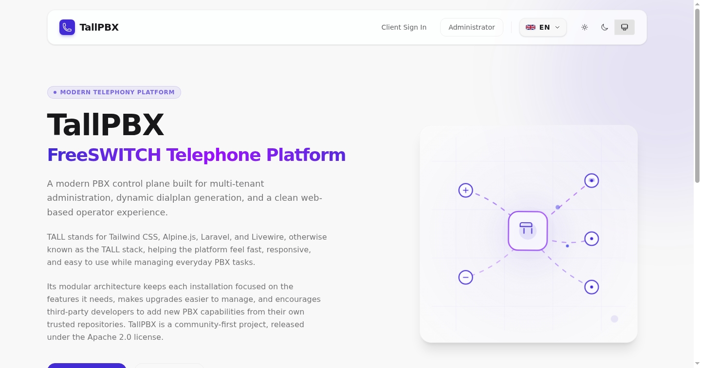
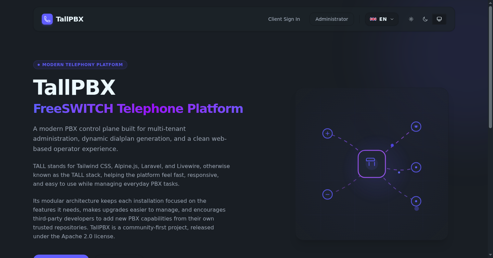
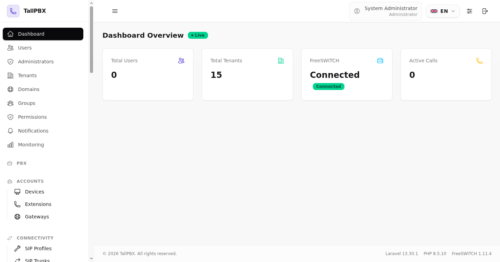
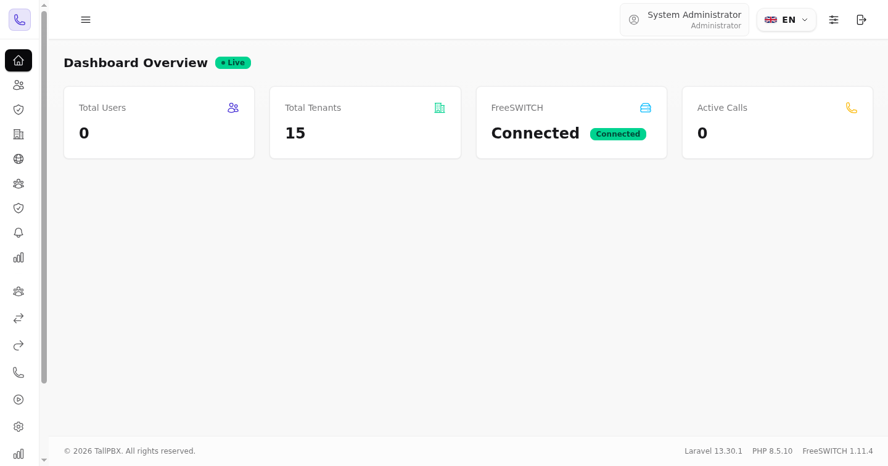
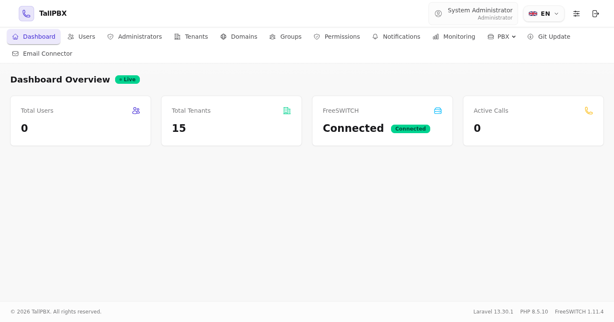

# TallPBX

TallPBX is a self-hosted business phone system named after its foundation on the **TALL stack** (**T**ailwind CSS, **A**lpine.js, **L**ivewire, and **L**aravel). It gives an administrator a web control panel for setting up and managing phones, extensions, call routing, voicemail, recordings, and other everyday PBX features. It runs on your own Debian server and uses FreeSWITCH® to handle calls.

## What You Can Do With It

- Create extensions and connect desk phones or softphones.
- Route incoming calls to people, ring groups, menus, queues, voicemail, or
  conferences.
- Configure outbound calling through a SIP trunk or gateway.
- Manage voicemail, call recordings, music on hold, announcements, and fax.
- Deliver voicemail notifications, password resets, and system alerts via standard username/password SMTP authentication or OAuth 2.0 (Google, Microsoft 365, or custom providers).
- Operate one or more customer or business tenants from the same system.
- Keep backups and restore approved backup operations.

TallPBX is the phone-system software, not a telephone carrier. You need a SIP
trunk or gateway from a provider if you want to place or receive public phone
network calls.

## Community First

TallPBX is a community-first project, released under the [Apache 2.0 license](https://opensource.org/licenses/Apache-2.0). Encouraging third-party development is the primary goal — integrations, modules, and contributions from the community are always welcome. Commercial use is welcome too and secondary to that goal, though it remains a strong motivation for us to keep developing TallPBX ourselves.

## Parity with FusionPBX & FreePBX®

TallPBX delivers feature and function parity with established open-source PBX platforms like FusionPBX and FreePBX®, rebuilt on a modern Laravel 13, Livewire 4, and Tailwind CSS architecture with comprehensive automated test coverage:

| Metric / Dimension | TallPBX | FusionPBX | FreePBX® |
| :--- | :--- | :--- | :--- |
| **Telephony Engine** | **FreeSWITCH 1.11** (`mod_sofia`, `mod_callcenter`) | **FreeSWITCH 1.11** | **Asterisk 20+** (PJSIP, chan_sip) |
| **Core Web Stack** | **Laravel 13, Livewire 4, Tailwind v4** | Custom procedural/OOP PHP (legacy) | BMO (custom procedural PHP framework) |
| **Database Support** | **MariaDB / MySQL** (SQLite in testing) | PostgreSQL / SQLite / MariaDB | MariaDB / MySQL |
| **Configuration Model** | **Dynamic `mod_xml_curl`** (No static XML on disk) | Dynamic `mod_xml_curl` (PHP scripts) | Static `.conf` files written to disk (`#include`) |
| **Multi-Tenancy** | **Native Multi-Tenant** (Isolated contexts, domains, data) | **Native Multi-Tenant** (Domain-based) | **Single-Tenant Core** (Multi-tenant requires commercial PBXact) |
| **User Interface & Layout** | **Dual Layouts**: Collapsible mini-rail sidebar (`w-16` / `w-64`) & horizontal topbar dropdowns with per-user persistence | Fixed top navbar (legacy procedural HTML) | Fixed top navbar (classic FreePBX theme) |
| **Automated Testing** | **1,993 Pest tests + 44 Dusk browser tests** | Minimal / community scripts | Minimal unit tests |
| **Licensing** | **Apache 2.0** (100% open source) | MPL 1.1 (Open source) | GPLv3 (Core) + Commercial closed modules |

See the [Feature and Function Parity Guide](docs/parity-comparison.md) for the complete domain-by-domain breakdown across all 58 PBX modules (Extensions, Routing, PBX Features, Media, Operations, and Administration).

## User Interface & Visual Tour

TallPBX is built on the **TALL stack** (Tailwind CSS v4, Alpine.js, Livewire 4, Laravel 13) with DaisyUI components, offering a modern responsive control panel with light and dark themes and three switchable navigation layouts:

| Public Landing (Light Theme) | Public Landing (Dark Theme) |
| :---: | :---: |
| [](docs/ui-tour.md#1-public-guest-landing-page) | [](docs/ui-tour.md#1-public-guest-landing-page) |

### Unified Panel & Flexible Navigation Layouts

The single unified panel (`/panel/`) adapts to administrator preference with instant theme and layout toggles persisted to the database:

| Full Sidebar (`w-64`) | Mini Icon Rail (`w-16`) | Horizontal Topbar |
| :---: | :---: | :---: |
| [](docs/ui-tour.md#mode-a-full-sidebar-navigation-w-64) | [](docs/ui-tour.md#mode-b-mini-icon-rail-sidebar-w-16) | [](docs/ui-tour.md#mode-c-horizontal-topbar-navigation) |

👉 **[Explore the Complete Visual Tour (Tenants, Extensions, Devices & Layouts) →](docs/ui-tour.md)**

## Quick Start

1. Prepare a Debian 13 server with at least 1 GB RAM, 2 GiB swap, 1 CPU core,
   and 25 GB disk space.
2. Follow the [installation guide](INSTALL.md). It walks through server setup,
   the installer, and the first login.
3. Open the server's IP address in a browser and sign in with the administrator
   email and password chosen during installation. If you selected a browser
   setup option, open `/panel/setup` first instead.
4. Follow the [PBX "Hello World" Guide](docs/pbx-hello-world.md) to create your
   first extension, register a softphone (MicroSIP, Linphone, or desk phone),
   and place an audio loopback echo test call (`*9196`).

The installer installs TallPBX, FreeSWITCH, the web server, database, and other
required services. It is safe to run again after an interrupted installation;
it preserves existing application data and saved installation choices.

For a normal PBX server, choose **No** when the installer asks about demo data
and development tooling. The `--no-demo` and `--no-development` flags skip
those individual choices for an unattended install. [Full installation guide →](INSTALL.md)

## Prerequisites

- Debian 13 server
- Root / sudo access
- Internet connectivity
- Minimum resources: 1 GB RAM with a minimum of 2 GiB swap configured, 1 vCPU, 25 GB disk

## Modular Architecture

This project is built using a modular architecture with modules in the `app-modules/` directory:

- Modules reside under `app-modules/ModuleName/`
- PSR-4 namespaces map to the module's `src/` directory: `Modules\ModuleName\` → `app-modules/ModuleName/src/`
- Each module registers its own routes, views, migrations, menus, and permissions via its `ModuleServiceProvider`
- Modules are auto-discovered through Composer path repositories and Laravel package discovery

### Creating a New Module

Scaffold a new module with the `make:module` command:

```bash
php artisan make:module call-forwarding \
    --display-name="Call Forwarding" \
    --description="Forward calls to external numbers" \
    --category="PBX Features"
```

This creates the full directory structure:

```
app-modules/call-forwarding/
├── composer.json          # PSR-4 autoloading + Composer discovery
├── module.json            # Module manifest (version, namespace, requirements)
├── config/                # Module-specific config files
├── database/migrations/   # Database migrations
├── lang/en/               # English translations
├── resources/views/       # Blade views (namespace: call-forwarding::)
└── src/
    ├── Livewire/          # Livewire components
    └── Providers/         # ModuleServiceProvider
```

The generated provider extends `App\Support\ModuleServiceProvider`, which auto-registers standard views, migrations, routes, Livewire components, menu items, and permissions. Create a `routes/web.php` file only when the module needs custom routes beyond the standard panel list/create/edit conventions.

After scaffolding, add a Composer path repository in root `composer.json` and run `composer update` to register the module. First-party modules use `app-modules/*` path repositories; third-party modules may be installed from GitHub or private Composer repositories.

### Module Commands

TallPBX provides first-party Artisan commands for module discovery and registry maintenance:

```bash
# Sync module.json manifests into the database module registry
php artisan module:sync

# Sync only first-party modules under app-modules/
php artisan module:sync --only-local

# Build the TallPBX module manifest cache
php artisan module:cache

# Clear generated module manifest caches
php artisan module:clear

# List modules known to the registry
php artisan module:list
```

Plural aliases are also available for operator preference and compatibility:

```bash
php artisan modules:sync
php artisan modules:cache
php artisan modules:clear
php artisan modules:list
```

Composer is responsible for PHP autoloading and Laravel package discovery. The module cache stores TallPBX module metadata, not a separate PHP autoloader.

## Telephony Integration (mod_xml_curl)

Instead of generating static XML configurations on disk, this system serves dynamic configs to FreeSWITCH on demand over HTTP using `mod_xml_curl`:

- Dynamic directories, dialplans, and configurations are handled via the XML Handler API (`/api/v1/xml-handler`).
- Events are captured using a persistent ESL connection running under `php artisan freeswitch:listen`.
- Fresh installs install and enable the default PBX runtime modules: `mod_sofia` for SIP profiles, `mod_callcenter` for queues, `mod_dptools` for core dialplan applications, `mod_local_stream` and `mod_sndfile` for packaged media/MOH, and `mod_xml_curl` for app-served XML. The installer also writes `/etc/freeswitch/autoload_configs/xml_curl.conf.xml` with the generated XML handler token automatically and adds a systemd drop-in so FreeSWITCH starts after Nginx, PHP-FPM, MariaDB, and Redis.
- Non-demo fresh installs seed the Default tenant only. The installer separately
  creates the first administrator during installation or through `/panel/setup`;
  demo mode is the sole creator of sample tenants, extensions, SIP accounts,
  trunks, routes, voicemail boxes, and other callable PBX data.
- Fresh installs use FreeSWITCH's packaged US English Callie prompts for digits, voicemail, IVR, conference, and miscellaneous PBX audio, plus the packaged music-on-hold files when available. The XML handler serves `local_stream.conf` so queue MOH can use `local_stream://moh`.
- Media payloads such as call recordings, uploaded recordings, voicemails, and fax files are stored on disk. The database stores paths and metadata only.

For tenant routing, TallPBX prefers tenant-specific call contexts over domain names. A domain name can still be used as a fallback, but domains are not treated as the only way to identify a tenant. This allows multiple tenants to share the same SIP domain when the deployment needs that.

### XML Handler Performance Knobs

The XML handler is a hot path: FreeSWITCH can call it during directory lookup, dialplan routing, and configuration requests. The app keeps successful per-request XML handler logging off by default, uses short-lived generated dialplan XML caching to avoid rebuilding identical tenant/context/destination responses during call bursts, and caches context-wide standard dialplan fragments so mixed-destination bursts do not repeatedly query the same base dialplans.

Relevant `.env` settings:

```bash
# Keep auth enabled outside tightly controlled local testing.
FREESWITCH_XML_HANDLER_AUTH=true
FREESWITCH_XML_HANDLER_TOKEN=generated-by-installer

# Successful request debug logging is intentionally opt-in.
FREESWITCH_XML_HANDLER_LOG_REQUESTS=false

# Repeated generated dialplan XML cache. Set 0 to disable.
FREESWITCH_XML_HANDLER_DIALPLAN_CACHE_TTL=5

# Repeated context-wide fragment cache for standard dialplans and contributors.
FREESWITCH_XML_HANDLER_DIALPLAN_CONTRIBUTOR_CACHE_TTL=5

# Production default. Use file only for simple local installs without Redis.
CACHE_STORE=redis

# Production default. Use file only for simple local installs without Redis.
SESSION_DRIVER=redis
SESSION_CONNECTION=cache

# Optional. Defaults to CACHE_STORE.
FREESWITCH_XML_HANDLER_DIALPLAN_CACHE_STORE=redis
```

Redis is the recommended cache and session backend for this project because the XML handler is a hot path, control-panel sessions should not depend on local disk, and file/database stores add avoidable I/O under concurrent calls. Simple local development can temporarily use `CACHE_STORE=file` and `SESSION_DRIVER=file` if Redis is not installed.

Fresh installs enable Redis automatically. For an existing server, install and enable Redis before switching these `.env` values:

```bash
apt-get install -y redis-server redis-tools php8.5-redis
systemctl enable --now redis-server
redis-cli ping
```

After changing these settings, clear and rebuild Laravel caches:

```bash
php artisan optimize:clear
php artisan optimize
```

## Running the Application

```bash
# Serve the Laravel app (development)
php artisan serve

# Compile frontend assets (in a new terminal)
npm run dev
```

In production, Nginx serves the application — the installer configures this automatically. After making code changes, clear caches:

```bash
php artisan optimize:clear
```

Generated files in `bootstrap/cache` and `public/build` must be readable by PHP-FPM/Nginx (`www-data`). Artisan commands repair generated permissions automatically, and `npm run build` runs a post-build repair script. If assets or cache files are generated manually as `root`, run:

```bash
bash scripts/fix-generated-permissions.sh
```

### Panel Navigation & Layout Modes

The unified control panel provides flexible navigation layouts designed to maximize screen real estate for wide data tables (CDRs, routing rules, active calls, extensions):

- **Collapsible Sidebar (Mini "Icon Rail"):** On desktop, users can collapse the vertical sidebar from its standard expanded width (`256px`) down to a compact `64px` icon rail with centered icons, hover tooltips, and flyout popover submenus for grouped PBX categories. A toggle button is pinned at the bottom of the sidebar (`[«]` / `[»]`) and accessible via the desktop header toggle.
- **Horizontal Header Navigation:** Users can switch to a full-width top-bar layout with standard dropdown menus (`menu menu-horizontal`), familiar to operators migrating from FusionPBX or classic PBX systems.
- **Display Preferences:** A unified **Display Settings** dropdown in the header allows users to switch between Sidebar and Top Navigation, adjust sidebar size, and toggle themes (Light, Dark, System). Preferences are saved immediately to `localStorage` for zero-flicker rendering and synced to the user profile in the database.
- **Mobile Responsive Fallback:** Regardless of the chosen layout mode, viewports below `1024px` automatically fall back to an accessible slide-over mobile drawer.
- **Scroll Preservation:** Panel navigation uses Livewire `wire:navigate.preserve-scroll` with persisted scroll containers in `resources/views/layouts/app.blade.php`. The sidebar drawer and nav keep `data-panel-sidebar-scroll`, and nested menu sections, including PBX → Advanced, preserve the recursive `persistedNavigation` flag in `resources/views/components/sidebar-menu-item.blade.php` so navigating between pages never resets scroll position.

**Tooltips:** Hover over items in the control panel or the ⓘ icon to see more information.

## Running Tests

Tests use Pest with a tiered runner for speed:

```bash
# Smoke — critical-path verification (~20s)
php artisan app:test --smoke

# Default — all feature tests, parallel by default (~65s)
php artisan app:test

# Full — features + Dusk browser tests (~150s, requires Chromium)
php artisan app:test --full

# Filter a specific test file
php artisan test --filter=AdminAuthTest

# Sequential debugging (no --parallel)
php artisan app:test --sequential

# Optional: clear Laravel caches before testing
php artisan app:test --smoke --clear-cache
```

The `app:test` command applies `--parallel` and `--compact` automatically. Both `php artisan app:test` and `php artisan test` use an in-memory SQLite database and temporary array-backed cache and session stores, so test data cannot use the server's MariaDB database. The recommended `app:test` command also removes inherited `.env` values before it starts Pest. A second check stops a test process if it is configured with anything other than in-memory SQLite. Run smoke after small changes, default before committing, and full before pushing.

The smoke tier includes a tiny seeded PBX XML-handler repeat check that makes sure internal, inbound, outbound, and generated-cache dialplan responses continue to work without running external SIPp traffic or high-volume load.

## PBX Dialplan Load Testing

The primary PBX performance test is the Laravel-generated dialplan XML path, not direct SIP traffic to FreeSWITCH. Direct SIP tests mostly measure FreeSWITCH; `pbx:load-test:dialplan` measures the app path that FreeSWITCH reaches through `mod_xml_curl`.

Seed repeatable synthetic PBX data:

```bash
php artisan pbx:load-test:seed \
  --tenant=load-test-beta \
  --domain=load.test.local \
  --extensions=100 \
  --start=2000 \
  --password='LoadTest1234!' \
  --reset
```

Run against the real Nginx/PHP-FPM endpoint, not `php artisan serve`:

```bash
php artisan pbx:load-test:dialplan \
  --tenant=load-test-beta \
  --url=http://PBX_HOST/api/v1/xml-handler \
  --scenario=mixed \
  --requests=100 \
  --concurrency=5 \
  --token="$FREESWITCH_XML_HANDLER_TOKEN" \
  --label="small-office-smoke" \
  --max-failure-rate=0 \
  --max-p95-ms=1000 \
  --report=storage/app/load-tests/dialplan-smoke.json
```

Use `--scenario=cache-hit` to repeat one exact dialplan lookup and isolate XML cache-hit behavior. Use `--scenario=mixed` for a more realistic blend of internal, inbound, and outbound requests.

For concurrency testing, prefer Redis or another memory-backed store for `FREESWITCH_XML_HANDLER_DIALPLAN_CACHE_STORE`. After changing cache-related env values, run `php artisan optimize:clear` followed by `php artisan optimize` before load testing the real PHP-FPM endpoint. Avoid running `optimize:clear` while traffic is active; PHP-FPM workers can briefly fail if they request bootstrap cache files while those files are being rebuilt.

Useful tiers:

| Tier | Requests | Concurrency | Purpose |
|---|---:|---:|---|
| Baseline | 25 | 1 | Confirm endpoint health and cold/warm latency. |
| Smoke | 100 | 5 | Catch auth, XML, routing, and moderate queueing issues. |
| Practical repeat check | 500 | 10-25 | Expose PHP-FPM, DB, Redis, and contributor problems that may return on small/medium workloads. |
| Optional stability | 1,000 | 25 | Use after meaningful code/config changes to confirm a longer burst stays stable. |

The command writes JSON reports under `storage/app/load-tests/`. Reports include run labels, Git commit state, load-generator environment details, scenario counts, success/failure rates, latency sample counts, threshold settings, and pass/fail reasons. The current `192.168.1.76` beta host is a Windows-hosted VM, so use these runs for relative comparison checks rather than capacity claims. Run heavier capacity tiers only on representative VPS/datacenter hardware. The detailed operating guide, including the VM hardware specs used for the published practical results, is in `docs/call-simulation-load-testing.md`.

Report terms: `req/sec` is completed XML handler responses per second. `p50` is the median response time. `p95` and `p99` mean 95% and 99% of responses finished at or below that latency. `max` is the slowest single response in the run.

For SIPp end-to-end validation, run the load generator from WSL2 or a separate Linux VM when possible:

```bash
PBX_HOST=192.168.1.76 \
LOAD_GENERATOR_IP=LOAD_GENERATOR_IP \
FORCE_SEED=1 \
scripts/pbx-sipp-validate.sh
```

The SIPp runner registers seeded users, starts an auto-answer registered endpoint, starts an outbound-route UAS, places extension-to-extension and outbound-route calls, and writes artifacts under `storage/app/load-tests/sipp-e2e-*`.

For optional live media validation of recording, music-on-hold, and announcement paths, add `MEDIA_FLOW=1`. This seeds synthetic media destinations and runs low-volume SIPp RTP echo calls; use it only after the basic SIPp call path is already passing.

Expected basic SIPp result: the script exits `0`, `summary.md` shows all basic scenarios passed, and each SIPp log shows successful calls equal to the requested count with zero failed calls. The detailed server-to-server SIPp guide is in `docs/sipp-server-to-server-validation.md`. It explains the WSL2/separate-VM topology, manual commands, artifacts, expected results, and how to interpret failures.

### PHP-FPM Load-Test Tuning

Inspect active PHP-FPM worker limits:

```bash
php-fpm8.5 -tt 2>&1 | grep -E 'pm\.max_children|pm\.start_servers|pm\.min_spare_servers|pm\.max_spare_servers|pm\.max_requests'
tail -n 50 /var/log/php8.5-fpm.log
```

If the log repeatedly shows `server reached pm.max_children`, requests are queueing behind PHP-FPM. The standard install recommendation for a 4 GB combined PBX/application server is:

```ini
pm = static
pm.max_children = 12
pm.max_requests = 500
```

In `static` mode, all workers are ready for FreeSWITCH XML handler bursts; `pm.start_servers`, `pm.min_spare_servers`, and `pm.max_spare_servers` are ignored. Use `INSTALL.md` for small/standard/larger server sizing guidance. More workers are not automatically faster: tune PHP-FPM while watching CPU load, memory, MariaDB, and XML handler latency.

## Tech Stack

| Component | Version |
|---|---|
| Laravel | 13 |
| Livewire | 4 |
| Tailwind CSS | 4 |
| DaisyUI | latest |
| Alpine.js | 3 (via Livewire) |
| Laravel Boost | 2 (dev) |
| Pest | 4 |

## License

Open-sourced under the [Apache 2.0 license](https://opensource.org/licenses/Apache-2.0).
