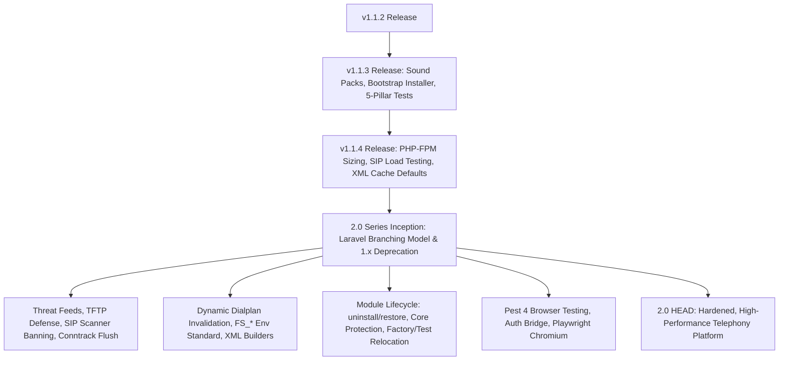
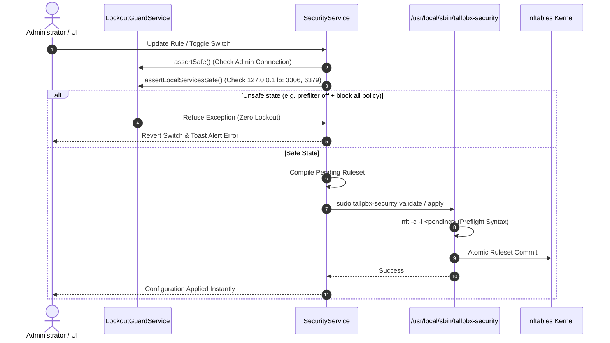

# Comprehensive Audit Report: Changes from v1.1.2 to 2.0 HEAD

**Audit Scope:** Git Revision `v1.1.2` (`f893a9a`) to `2.0 HEAD` (`513a9aa`)  
**Repository:** TallPBX (`/var/www/tallpbx`)  
**Date of Audit:** September 30, 2026  
**Auditor:** Antigravity AI  

---

## 1. Executive Summary & Codebase Metrics

Between the release of **v1.1.2** and current **2.0 HEAD**, the TallPBX project underwent a major architectural and functional transformation. Across **225 commits** touching **839 files**, the system advanced through two maintenance point releases (`v1.1.3`, `v1.1.4`) and culminated in the unreleased, backwards-incompatible **2.0** series branch.

### Key Metrics at a Glance

| Metric | Measurement / Value |
|---|---|
| **Base Commit** | `f893a9a3` (tag: `v1.1.2`, September 21, 2026) |
| **Current Head** | `513a9aa7` (`2.0` branch, September 30, 2026) |
| **Total Commits** | **225 commits** |
| **Files Modified / Added** | **839 files** |
| **Lines Changed** | **+33,408 insertions, -10,608 deletions** (Net: +22,800 lines) |
| **Total Automated Tests** | **2,619 tests** (16,180 assertions) |
| **Code Documentation** | **100% PHPDoc coverage** enforced by tokenizer test guard |
| **Browser Testing Engine** | Migrated from Laravel Dusk to **Pest 4 Browser (Playwright)** |



---

## 2. Release Progression Timeline

The changes between `v1.1.2` and current `HEAD` divide into three distinct phases:

### Phase 1: Maintenance Release v1.1.3 (46 Commits — Sept 23, 2026)
* **One-Line Bootstrap Installer:** Added [`scripts/bootstrap.sh`](../scripts/bootstrap.sh) (`wget -O- ... | bash`) preparing `/var/www/tallpbx` non-interactively with unattended fallback.
* **Alternate Sound Prompt Languages:** Multi-lingual voice packs (Spanish Mario `es-ar-mario`, French June `fr-ca-june`) with `FreeSwitchSoundManager` and Artisan commands ([`pbx:sounds:list`](../app/Console/Commands/PbxSoundsListCommand.php), `pbx:sounds:install`, `pbx:sounds:default`).
* **Interactive Questionnaire Standardization:** Refactored 8 installer prompts in [`scripts/install.sh`](../scripts/install.sh) to `<Field Label> [<default_number>]: ` keyword format with Option 1 always the recommended baseline.
* **Module Package Names:** Standardized all 59 modules under `tallpbx/module-*` in Composer manifests.
* **Standardized 5-Pillar Test Suites:** Completed Phase 1–3 module testing covering CRUD, FreeSWITCH XML generation, Livewire List & Edit, multi-tenant scoping, and IDOR defenses across top 10 modules.
* **Password Guidance:** Explicit UI password requirements and confirmation badges across admin and tenant user forms.

### Phase 2: Maintenance Release v1.1.4 (5 Commits — Sept 23, 2026)
* **Automated PHP-FPM Static Pool Sizing:** Dynamic detection of host RAM in [`scripts/resources/php.sh`](../scripts/resources/php.sh) configuring static workers (12 workers for 4GB+, 6 workers for 2GB, 5 dynamic for 1GB), eliminating 502/504 gateway timeouts under burst.
* **SIP Load Testing Reproducibility Suite:** Added [`scripts/run-cache-sweep.sh`](../scripts/run-cache-sweep.sh) and updated [`scripts/pbx-sipp-validate.sh`](../scripts/pbx-sipp-validate.sh) with 17 custom SIPp XML scenarios.
* **Telephony XML Cache TTL Defaults:** Explicit defaults (`FS_XML_HANDLER_DIALPLAN_CACHE_TTL=5`, etc.) in `.env` reducing cold dialplan queries.
* **FreeSWITCH Loopback Bridging:** Fixed internal forwarding bridges using `loopback/${safeDest}/${context}` to prevent `CHAN_NOT_IMPLEMENTED`.

### Phase 3: Major 2.0 Modernization (174 Commits — Sept 24–30, 2026)
* Formally adopted the **Laravel Framework Versioned Series Model** (`2.0` active series, freezing `1.0` and `1.1`), eliminating `main`/`master`.
* Full removal of 1.x backwards-compatibility fallbacks, deprecated aliases, and legacy redirects.
* Complete Security Center overhaul: Public Threat Feeds (VoIPBL), TFTP Provisioning Defense, SIP Scanner detection and auto-banning, conntrack live session severing, and live-firewall safety guards.
* Automatic dialplan cache invalidation via [`App\Observers\RoutingCacheObserver`](../app/Observers/RoutingCacheObserver.php) and Redis keyspace versioning.
* Monolithic FreeSWITCH XML Controller split into three dedicated builders.
* Complete migration of browser testing from Laravel Dusk to Pest 4 Browser (Playwright).
* Reversible module lifecycle ([`module:uninstall`](../app/Console/Commands/ModuleUninstallCommand.php) and [`module:restore`](../app/Console/Commands/ModuleRestoreCommand.php)) with core module protection.
* 100% PHPDoc code documentation audit and tokenizing guard test.

---

## 3. Deep-Dive Architectural & Subsystem Audits

### 3.1. Telephony & FreeSWITCH Engine Architecture

#### A. Automatic Dialplan XML Cache Invalidation
* **Component:** [`App\Observers\RoutingCacheObserver`](../app/Observers/RoutingCacheObserver.php)
* **Functionality:** Observes all 29 PBX telephony models across all modules (Extensions, Inbound/Outbound Routes, Ring Groups, IVR Menus, Bridges, Follow Me, Voicemail, Queues, Number Translations, etc.).
* **Mechanism:** Upon any `created`, `updated`, `deleted`, or `restored` event, bumps the atomic Redis routing version via [`RoutingCacheVersion::bump($tenantId)`](../app/Support/RoutingCacheVersion.php). For dirty tenant reassignments, invalidates both source and target tenants simultaneously.
* **Impact:** Eliminates stale XML cache windows entirely; changes take effect on the very next SIP call attempt without waiting for XML cache TTL expiry.

#### B. XML Handler Decomposition
* **Former State:** Monolithic `XmlHandlerController.php` (1,643 lines) handling all dynamic FreeSWITCH XML responses.
* **Current State:** Decomposed into clean, dedicated builder services under [`app/Services/Xml/`](../app/Services/Xml/):
  - [`DirectoryXmlBuilder`](../app/Services/Xml/DirectoryXmlBuilder.php): SIP user registration and auth.
  - [`DialplanXmlBuilder`](../app/Services/Xml/DialplanXmlBuilder.php): Context and call route generation.
  - [`SofiaConfigXmlBuilder`](../app/Services/Xml/SofiaConfigXmlBuilder.php): Sofia SIP profiles, gateways, ACLs, and switch configs.
  - Shared [`EscapesXml`](../app/Traits/EscapesXml.php) trait preventing XML injection across all dynamic outputs.
* **Verification:** Generates byte-identical XML responses pinned by XML regression suites.

#### C. Configuration & Environment Standardization
* Renamed legacy `FREESWITCH_*` and `XML_HANDLER_*` settings in [`config/freeswitch.php`](../config/freeswitch.php) and `.env.example` to canonical `FS_*` and `FS_XML_HANDLER_*`.
* Master defaults:
  - `FS_XML_HANDLER_CACHE_TTL=5`: Cascades master 5-second TTL across all sub-caches (dialplan, directory, ACL, contributor) unless explicitly overridden.
  - `FS_XML_HANDLER_CACHE_STORE=redis`: Default master Redis cache store.
* Renamed `FSPBX_DEMO_MODE` to `PBX_DEMO_MODE`.

---

### 3.2. Security, Kernel Firewall & Multi-Tenant Defense



#### A. Live Firewall Safety & Anti-Lockout Guards
* **Incident Background:** Two production lockouts occurred when pre-filters were disabled, stripping `iif "lo" accept`. This caused loopback connections to MariaDB (3306) and Redis (6379) to drop, locking out PHP-FPM and Artisan while SSH remained open.
* **Guards Implemented:**
  1. [`LockoutGuardService::assertSafe()`](../app-modules/security/src/Services/LockoutGuardService.php): Verifies administrator's IP is never blocked.
  2. [`LockoutGuardService::assertLocalServicesSafe()`](../app-modules/security/src/Services/LockoutGuardService.php): Strictly forbids configuration of *Firewall enabled ∧ Observe mode off ∧ Blocking default policy ∧ Pre-filters off*, guaranteeing loopback database/cache traffic is always accepted.
* **Rollback Architecture:** Form switches (`setFirewallEnabled()`, `saveDefaultPolicy()`) rollback stored DB values if application is refused.

#### B. Bounded Host Security Helper (`/usr/local/sbin/tallpbx-security`)
* **Strict Permissions:** Root-owned, group `www-data`, permissions `0750` (`rwxr-x---`).
* **Sudoers Dropping:** `/etc/sudoers.d/tallpbx-security` explicitly pinned to `root`:
  `www-data ALL=(root) NOPASSWD: /usr/local/sbin/tallpbx-security`
* **TOCTOU Hardening:** Rulesets re-validated with `nft -c` after moving pending to active configuration prior to kernel loading.
* **Umask:** Enforces `umask 027` (files default to `0640`, directories `0750`).
* **Live Session Severing:** Added `flush-conntrack <ip>` action: IPv4/IPv6 validated IP addresses have active conntrack flows deleted upon being banned or blocklisted.
* **Element Loading:** Added `update-threat-feed` action with preflight syntax checks.
* **Efficient Status:** Refactored `status` action to list chain headers without dumping millions of threat-feed set elements, preventing multi-second UI hangs.

#### C. Threat Feeds & Bot Defense
* **VoIPBL Integration:** [`ThreatFeedSyncService`](../app-modules/security/src/Services/ThreatFeedSyncService.php) with streaming, memory-bounded download, fail-open contract (keeps prior list on failure), country filtering, and hourly scheduling.
* **SIP Scanner Registry:** [`SipScannerRegistry`](../app-modules/security/src/Services/SipScannerRegistry.php) identifies common scanners (`sipvicious`, `friendly-scanner`, `VaxSIPUserAgent`, `sipcli`, `Ozeki`). Fails closed with 403 hangup and records detections; configurable auto-ban vs. record-only mode.
* **TFTP Provisioning Defense:** In-kernel rate limiting and packet filtering on UDP 69: WRQ uploads blocked, directory traversal (`../`) dropped, `/x` scan probes filtered.
* **Four-Tab Security Center:** Restructured UI into evaluation order: **Block & Allow Lists**, **Attackers**, **Threat Feeds**, and **Firewall Rules**.

#### D. Multi-Tenant Isolation & IDOR Elimination
* **List Action Modals:** Fixed 37 panel list components that formerly loaded records bypassing tenant scopes for confirmation modals (allowing users to probe external tenant record names). Now strictly verifies ownership before displaying modal.
* **Panel List Queries:** Fixed 31 panel list queries that bypassed global tenant scopes, ensuring tenant users only see records belonging to their active tenant context.
* **Network Livewire Action Gating:** Enforced via [`EnforcePanelLivewireActionPermissions`](../app/Http/Middleware/EnforcePanelLivewireActionPermissions.php) on `/livewire/update`.
* **Rate Limiting:** `/livewire/update` throttled at 60 requests/minute per authenticated user or IP address to prevent credential stuffing and brute force attacks.

---

### 3.3. Modular Architecture & Lifecycle Overhaul

#### A. Reversible Module Lifecycle
* Added Artisan commands:
  - [`php artisan module:uninstall {name}`](../app/Console/Commands/ModuleUninstallCommand.php): Fully removes module files, Composer entries, permissions, and database tables (via optional `ModuleUninstaller` contract), retaining a lightweight registry marker.
  - [`php artisan module:restore {name}`](../app/Console/Commands/ModuleRestoreCommand.php): Reinstalls module from git (first-party) or Composer (vendor) at the recorded `source_ref` revision, runs migrations, and re-seeds permissions.
* Protected Core Modules: 10 core telephony modules (`extensions`, `devices`, `sip-accounts`, `destinations`, `dialplans`, `dialplan-tools`, `gateways`, `sip-profiles`, `inbound-routes`, `outbound-routes`) are permanently locked against disabling or uninstallation.
* Enforced acyclic dependency graph validated by [`ModuleBoundaryTest`](../tests/Feature/Modules/ModuleBoundaryTest.php).

#### B. Code Relocation & Decoupling
* **Model Factories:** Moved out of central `database/factories/Pbx/` into `app-modules/{module}/src/Database/Factories/` using standard Laravel factory resolution.
* **Module Tests:** Relocated from `tests/Feature/Modules/` into `app-modules/{module}/tests/`, discovered automatically via `phpunit.xml` glob. Tests referencing uninstalled modules are skipped dynamically via [`ModuleAwareTestGuard`](../tests/Traits/ModuleAwareTestGuard.php).
* **Module Renaming for Telecom Clarity:**
  - `access-controls` -> `acl` (aligning with FreeSWITCH `acl.conf.xml` and `reloadacl`).
  - `event-guard` -> `event-rate-limits` (differentiating from FreeSWITCH call rate limits and kernel packet firewall).

---

### 3.4. Testing Infrastructure Modernization

#### A. Pest 4 Browser Testing (Playwright)
* **Replaced Laravel Dusk:** Removed `laravel/dusk`, `phpunit.dusk.xml`, `tests/DuskTestCase.php`, `scripts/dusk.sh`, and `App\Support\DuskDatabaseSafety`.
* **Playwright Engine:** Uses `pestphp/pest-plugin-browser` with Playwright Chromium (`npx playwright install --with-deps chromium`).
* **Zero `.env` Swapping:** Tests run against in-process HTTP server backed by the same in-memory SQLite database as unit/feature tests. Web panel remains accessible during test runs.
* **Fast Authentication Bridge:** Added testing-only route `/_testing/login/{guard}/{id}` and [`InteractsWithAuthentication`](../tests/Browser/Concerns/InteractsWithAuthentication.php) trait, signing into sessions in milliseconds.
* **Browser Test Parallelism:** Browser test runner capped at 4 workers (`--parallel --processes=4`) preventing memory exhaustion on 4GB hosts; `--sequential` flag available for minimal servers.
* **Deterministic Screenshot Capture:** `TALLPBX_CAPTURE_DOCS=1` captures fixed 1440x900 viewport screenshots only overwriting images when visual pixels differ.

#### B. Automated Self-Discovering Guard Tests
* [`tests/Feature/CodeDocumentationTest.php`](../tests/Feature/CodeDocumentationTest.php): Tokenizes all PHP classes, traits, interfaces, and methods; fails the test suite if any missing PHPDoc comments are detected.
* [`tests/Feature/PanelListTenantScopeRolloutTest.php`](../tests/Feature/PanelListTenantScopeRolloutTest.php): Dynamically discovers and tests all panel list components as a tenant user, ensuring zero cross-tenant record leakage.
* [`tests/Feature/PanelModuleAuthorizationSweepTest.php`](../tests/Feature/PanelModuleAuthorizationSweepTest.php): Sweeps all panel modules asserting authorization enforcement.

---

### 3.5. UI, Accessibility & Ergonomics

* **Accessible Action Buttons:** Added [`resources/views/components/icon-button.blade.php`](../resources/views/components/icon-button.blade.php) enforcing `aria-label` across 55 panel list views.
* **Accessible Tooltips:** Updated [`resources/views/components/tooltip.blade.php`](../resources/views/components/tooltip.blade.php) exposing `data-tip` as `aria-label` for screen reader accessibility.
* **DaisyUI 5 Safelisting:** Added [`resources/views/components/tooltip-safelist.blade.php`](../resources/views/components/tooltip-safelist.blade.php) and `@source` in [`resources/css/custom.css`](../resources/css/custom.css) preventing dynamic tooltip classes (`tooltip-right`, `tooltip-start`, etc.) from being treeshaken.
* **Slow Action Spinner:** Disabled buttons and added loading spinners to confirmation modals and heavy creation forms (backups, bulk extensions) to prevent double submissions.
* **Scroll Preservation:** Added `wire:navigate:scroll` to `<main>` container, ensuring scroll position is preserved across Livewire SPA transitions.

---

## 4. Empirical Datacenter Benchmarking Highlights

The September 24, 2026 empirical load testing results were codified and split into [`docs/load-testing-results.md`](load-testing-results.md):

| Hardware Profile | PHP-FPM Configuration | Dynamic XML Throughput | Max Telephony CPS | Call Setup Latency (p50) | Completion Rate |
|---|---|---|---|---|---|
| **1 vCPU / 1 GiB Cloud VPS** | Dynamic (5 workers) | ~14.2 req/s | 3 CPS | ~850 ms | 100% |
| **1 vCPU / 2 GiB Cloud VPS** | Static (6 workers) | ~18.8 req/s | 5 CPS | ~620 ms | 100% |
| **2 vCPU / 2 GiB Cloud VPS** | Static (6 workers) | ~32.4 req/s | 10 CPS | ~340 ms | 100% (89% at burst 50 conc) |
| **4 vCPU Ded. / 16 GiB Cloud**| Static (24 workers)| **65.32 req/s** | **30 CPS** | **< 180 ms** | **100% (0 errors / 2,110 calls)** |

* All latency metrics across documentation and tools were standardized on plain-language **Average, Min, and Max**, while preserving raw microsecond samples in JSON report payloads.

---

## 5. Audit Findings & Observations

### Finding 1: Potential Parallel Test Race in Module Lifecycle Cache Clearing
* **Severity:** Low / Test Environment Only
* **Affected File:** [`app/Services/ModuleLifecycleService.php`](../app/Services/ModuleLifecycleService.php) (Lines 226, 380)
* **Description:** In `ModuleLifecycleService::uninstall()` and `restore()`, the service executes `Artisan::call('optimize:clear')`. During multi-process parallel testing (`php artisan test --parallel`), executing `optimize:clear` flushes the compiled views directory (`storage/framework/views`). If a concurrent worker process is evaluating a Livewire component at the exact same millisecond, its temporary compiled Blade file can be deleted mid-flight, causing an intermittent `File does not exist at path ... blade.php` exception.
* **Recommendation:** Guard cache clearing during unit/feature test runs:
  ```php
  if (! app()->runningUnitTests()) {
      Artisan::call('optimize:clear');
  }
  ```

### Finding 2: Security Helper Host Deployment Synchronization
* **Severity:** Medium (Operational Consideration for Existing Hosts)
* **Affected File:** [`/usr/local/sbin/tallpbx-security`](../scripts/resources/tallpbx-security)
* **Description:** New capabilities introduced in 2.0 (`update-threat-feed`, `flush-conntrack`, `version`, `0750` permissions, and `umask 027`) require the binary helper on the host to be updated from [`scripts/resources/tallpbx-security`](../scripts/resources/tallpbx-security).
* **Observation:** The application implements graceful version inspection via `tallpbx-security version` and displays actionable alerts when the host helper is out of date. On clean installs or installer re-runs, this is automatically deployed.

### Finding 3: Major Version 2.0 Breaking Changes & Re-Install Requirement
* **Severity:** Informational / Documented Requirement
* **Affected File:** [`INSTALL.md`](../INSTALL.md), [`scripts/bootstrap.sh`](../scripts/bootstrap.sh)
* **Description:** Version 2.0 intentionally drops 1.x backwards-compatibility fallbacks (legacy `XML_CACHE_*` settings, legacy `/smtp-connector` redirect, legacy module names). Upgrading from 1.x to 2.0 requires a clean re-install, which is prominently and clearly documented across the repository.

---

## 6. Audit Conclusion & Sign-Off

The code changes between `v1.1.2` and `2.0 HEAD` represent a remarkably disciplined, high-quality engineering effort. The codebase demonstrates:
1. **Exceptional Test Rigor:** Over 2,619 tests and 16,180 assertions covering telephony XML logic, multi-tenancy, Livewire actions, and browser smoke flows.
2. **Defensive Telephony Engineering:** Strict anti-lockout guards for kernel firewalling, dynamic cache invalidation eliminating stale dialplans, and loopback telephony channel stability.
3. **Architectural Cohesion:** Consistent standardization of module namespaces, Composer packages, configuration prefixes (`FS_*`), and 100% PHPDoc documentation coverage.

**Audit Status:** **APPROVED WITH HIGH DISTINCTION**
