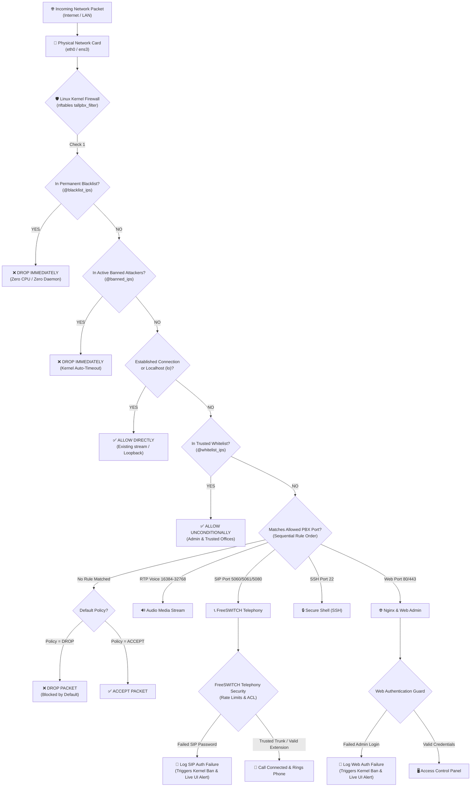
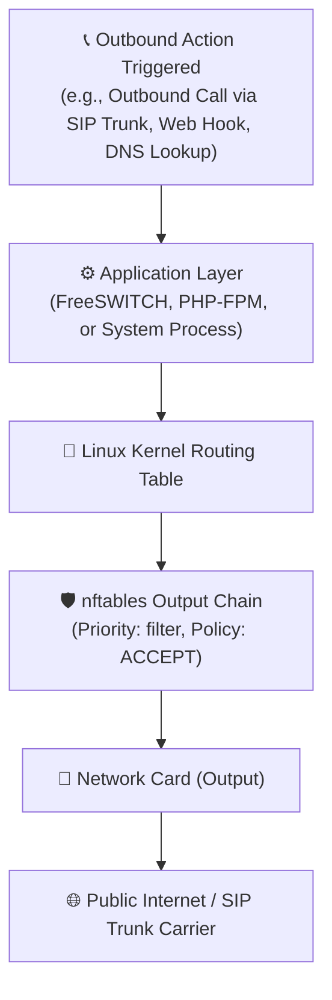
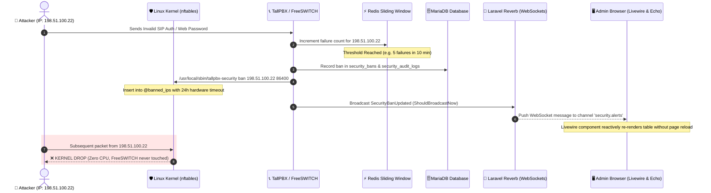

# TallPBX Security Architecture & Packet Flow Guide

This document provides a comprehensive, easy-to-understand overview of how TallPBX defends your business phone system and server. It explains how incoming network traffic travels through the security layers, how attacks are detected and neutralized in real time, and how settings survive server reboots.

---

## 1. Visual Packet Flow: Inbound Traffic (Ingress)

When an internet packet reaches the server's network interface, it is evaluated by the Linux kernel **before** any application software (like FreeSWITCH or the web server) ever sees it.

The diagram below illustrates this path from input to processing:

---

## 2. Visual Packet Flow: Outbound Traffic (Egress)

Outbound traffic generated by the server (such as FreeSWITCH connecting to a SIP provider trunk, outbound phone calls, or administrative web notifications) follows a streamlined outbound chain:

*Note: By default, the output chain policy is set to `ACCEPT`. The stateful connection tracker (`ct state established,related accept`) automatically correlates response packets from the outside world back to the originating outbound connection.*

---

## 3. Real-Time Attack Neutralization & WebSocket Alert Flow

TallPBX does **not** rely on slow log-scraping utilities like Fail2ban. Intrusion prevention occurs in-process with real-time sliding windows in Redis, immediate Linux kernel banning, and instant WebSocket broadcasting over **Laravel Reverb**:

---

## 4. Understanding Sequential Firewall Rules: "Top to Bottom"

Firewall rules in the **Security Command Center** are evaluated sequentially from top to bottom.

### How It Works: First Match Wins
1. When traffic arrives, the firewall tests Rule #1 at the top.
2. If Rule #1 matches the packet, the action (**Allow** or **Block**) is taken **immediately**, and the firewall **stops checking any lower rules**.
3. If Rule #1 does not match, the firewall moves down to Rule #2, Rule #3, and so on.
4. If no rule matches, the firewall falls back to the **Default Inbound Policy** (Drop or Accept).

### Real-World Example
Suppose you want to block all incoming web traffic from the world, but allow your branch office (`203.0.113.50`) to access the web panel:

* **Correct Order (Specific before General)**:
  - **Rule 1 (Top)**: Allow Source `203.0.113.50` on Port `443`
  - **Rule 2 (Bottom)**: Block Source `Anywhere` on Port `443`
  *Result*: Your branch office matches Rule 1 and connects successfully. Everyone else moves to Rule 2 and is blocked.

* **Incorrect Order**:
  - **Rule 1 (Top)**: Block Source `Anywhere` on Port `443`
  - **Rule 2 (Bottom)**: Allow Source `203.0.113.50` on Port `443`
  *Result*: Your branch office is blocked! Because Rule 1 matched "Anywhere" first, evaluation stopped before Rule 2 was ever reached.

You can use the **Up** and **Down** priority buttons in the Security Center to arrange rules so specific exceptions always sit above broader policies.

---

## 5. Multi-Layer PBX Security: What Protects What?

TallPBX features distinct layers of security designed for different parts of the system:

| Security Component | Layer | Technology | Primary Purpose | Example |
| :--- | :--- | :--- | :--- | :--- |
| **Host Firewall** | Network / Kernel (OS) | Linux `nftables` | Blocks unwanted network traffic before it reaches any service. Protects the entire operating system. | Dropping brute-force bots, restricting SSH to management IPs, blocking unauthorized SIP traffic. |
| **Attack Protection** | In-Process Intrusion Defense | Redis + Reverb + `nftables` | Tracks authentication failures across SIP, Web login, and SSH, and automatically bans offenders in kernel RAM. | Automatically blocking an IP for 24 hours after 5 failed phone registrations or admin passwords. |
| **Access Control Lists (ACL)** | Telephony Engine (FreeSWITCH) | FreeSWITCH `mod_sofia` ACLs | Authorizes which trusted IP subnets or devices are allowed to register SIP extensions or connect carriers inside the phone engine. | Allowing SIP carriers (e.g. Twilio, Telnyx) to deliver calls without SIP password challenges. |
| **Rate Limits (Telephony)** | Telephony Engine (FreeSWITCH) | FreeSWITCH `event_guard` | Controls call setup rates to prevent denial-of-service floods or SIP INVITE exhaustion attacks. | Limiting maximum incoming calls per second on external SIP profiles. |

---

## 6. Two-Tier Persistence & Server Reboot Retention

TallPBX uses a **two-tier architecture** to ensure security rules, IP lists, and active attacker bans survive reboots:

1. **Tier 1: MariaDB (Authoritative Source of Truth)**
   - Database tables (`security_bans`, `security_ip_lists`, `security_rules`, `security_settings`) permanently store all whitelisted IPs, blacklisted subnets, custom firewall rules, PBX port definitions, and active attacker bans.

2. **Tier 2: Boot Persistence (`/etc/tallpbx/firewall.nft` & `/etc/nftables.conf`)**
   - Whenever any security change is made in the web UI, [SecurityConfigGenerator](file:///var/www/tallpbx/app-modules/security/src/Services/SecurityConfigGenerator.php) compiles the active ruleset directly into `/etc/tallpbx/firewall.nft`.
   - The systemd boot loader `/etc/nftables.conf` includes `/etc/tallpbx/firewall.nft`.
   - When the Linux server reboots, systemd's `nftables.service` executes `/etc/nftables.conf` before networking starts, instantly restoring all rules, trusted IPs, and temporary attacker bans with their remaining expiration times intact.

3. **Zero-Lockout Protection**
   - Before any restrictive policy or rule change is applied, [LockoutGuardService](file:///var/www/tallpbx/app-modules/security/src/Services/LockoutGuardService.php) checks the current administrator's active connection IP against the proposed ruleset.
   - If a proposed change would disconnect or lock out the active administrator, the change is rejected immediately with a descriptive warning, protecting administrators from accidental lockouts.

---

## 7. Real-Time Responsiveness: No Polling, Zero Staging

* **No Manual Refresh Buttons**: The Security Command Center connects directly to **Laravel Reverb WebSockets** via **Laravel Echo**. When an attacker is banned, unbanned, or a rule is updated, status cards and threat tables update reactively within milliseconds.
* **Instant Auto-Application**: Administrators do not have to perform awkward multi-step "stage changes, then click Save & Apply" flows. Modifying an IP list, toggling a firewall rule, or adding a port catalog service immediately validates syntax atomically and applies to the running Linux kernel in real time.
