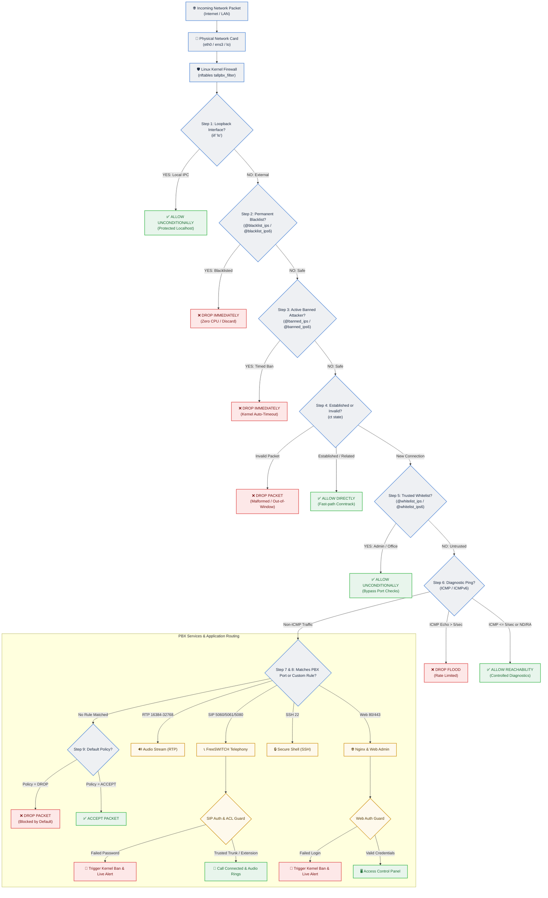
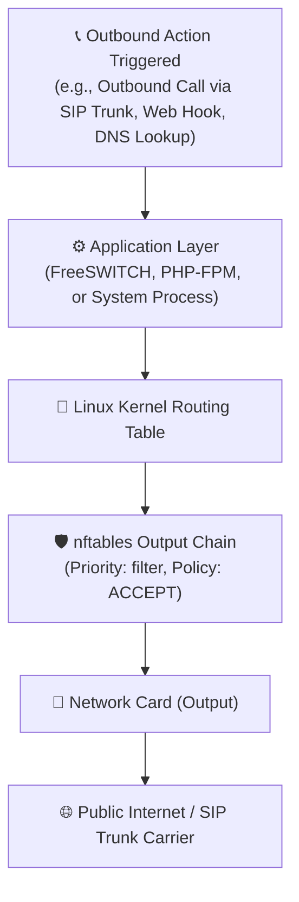
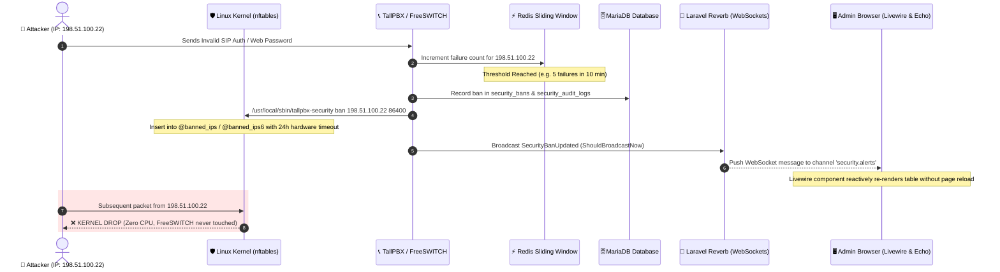
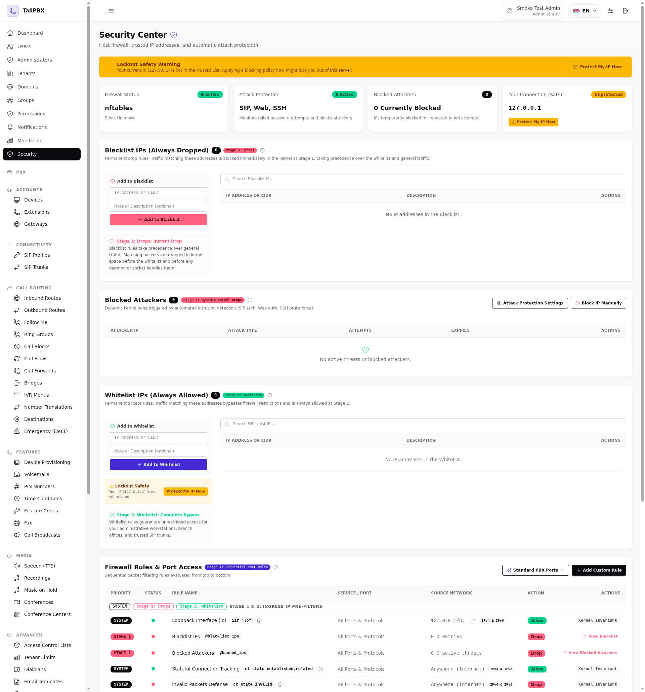

# TallPBX Security Architecture & Packet Flow Guide

This document provides a comprehensive, easy-to-understand overview of how TallPBX defends your business phone system and server. It explains how incoming network traffic travels through the security layers, how attacks are detected and neutralized in real time, and how settings survive server reboots.

---

## 1. Visual Packet Flow: Inbound Traffic (Ingress)

When an internet packet reaches the server's network interface, it is evaluated by the Linux kernel **before** any application software (like FreeSWITCH or the web server) ever sees it.

The diagram below illustrates this path from input to processing:



---

## 2. Visual Packet Flow: Outbound Traffic (Egress)

Outbound traffic generated by the server (such as FreeSWITCH connecting to a SIP provider trunk, outbound phone calls, or administrative web notifications) follows a streamlined outbound chain:



*Note: By default, the output chain policy is set to `ACCEPT`. The stateful connection tracker (`ct state established,related accept`) automatically correlates response packets from the outside world back to the originating outbound connection.*

---

## 3. Real-Time Attack Neutralization & WebSocket Alert Flow

TallPBX does **not** rely on slow log-scraping utilities like Fail2ban. Intrusion prevention occurs in-process with real-time sliding windows in Redis, immediate Linux kernel banning, and instant WebSocket broadcasting over **Laravel Reverb**:

> **What "sliding window" means here:** the engine never counts failed attempts forever. Every failure increments a small per-IP counter inside Redis — stored separately for each attack vector (SIP, web, and SSH) — and the counter automatically expires one **Detection Window** after the first failure of the streak (*"Time window in which failed attempts are counted"* — 10 minutes by default, adjustable in Attack Protection Settings). Only failures falling inside the window add up toward the **Max Allowed Failed Attempts** threshold; reaching it bans the IP and clears the counter so the next window starts empty. Redis keeps this accounting in memory and expires stale counters on its own, so per-login protection adds no database writes and no cleanup jobs.



---

## 4. Security Command Center Interface

The **Security Command Center** provides a single, unified view of the complete host firewall, active intrusion bans, trusted IP networks, and the sequential packet filtering pipeline:



### Key Interface Components
1. **Status & Threat Overview**: Real-time indicators for `nftables` firewall state, intrusion detection engine status, active ban counters, and administrator zero-lockout protection.
2. **Pipeline-Aligned IP Workbenches**: Arranged in the exact sequential order traffic is evaluated:
   - **Blacklist**: Permanent drop list with preflight guidance and search filtering.
   - **Blocked Attackers**: Active intrusion bans with vector badges (`SIP`, `Web`, `SSH`), automated hardware timeout countdowns, and protection sensitivity settings.
   - **Whitelist**: Permanent bypass list with 1-click self-protection for administrator IPs.
3. **Unified Firewall Rules Table**: Shows the complete, living Linux kernel packet filtering pipeline:
   - **Built-in Rules & Pre-Filters (Collapsible)**: A one-click collapsible header row consolidating the 6 sequential built-in rules and pre-filters: unconditional loopback access (`lo`), permanent blacklist IP drops, active intruder bans, stateful connection tracking (`ct state established,related`), invalid packet defense (`ct state invalid`), and trusted whitelist IP bypass.
   - **Stage 3 Standard Services**: Standard services evaluated top-to-bottom starting with **ICMP Ping Diagnostics** (configurable source network, toggleable, and customizable rate limit/burst allowance with dual-stack IPv4/IPv6 protection), followed by SIP Signaling, RTP Media, Web UI, SSH, FreeSWITCH ESL, Reverb WebSockets, and WebRTC.
   - **Stage 4 Custom Rules**: Sequential port rules with priority reordering.
   - **Stage 5 Default Policy**: Inbound fallback policy (`drop` or `accept`).

---

## 5. Understanding Sequential Firewall Rules: "Top to Bottom"

Firewall rules in the **Security Command Center** are evaluated sequentially from top to bottom.

### How It Works: First Match Wins
1. When traffic arrives, the firewall tests Rule #1 at the top.
2. If Rule #1 matches the packet, the action (**Allow** or **Block**) is taken **immediately**, and the firewall **stops checking any lower rules**.
3. If Rule #1 does not match, the firewall moves down to Rule #2, Rule #3, and so on.
4. If no rule matches, the firewall falls back to the **Default Inbound Policy** (Drop or Accept).

### Real-World Example
Suppose you want to block all incoming web traffic from the world, but allow your branch office (`203.0.113.50`) to access the web panel:

* **Correct Order (Specific before General)**:
  - **Rule 1 (Top)**: Allow Source `203.0.113.50` on Port `443`
  - **Rule 2 (Bottom)**: Block Source `Anywhere` on Port `443`
  *Result*: Your branch office matches Rule 1 and connects successfully. Everyone else moves to Rule 2 and is blocked.

* **Incorrect Order**:
  - **Rule 1 (Top)**: Block Source `Anywhere` on Port `443`
  - **Rule 2 (Bottom)**: Allow Source `203.0.113.50` on Port `443`
  *Result*: Your branch office is blocked! Because Rule 1 matched "Anywhere" first, evaluation stopped before Rule 2 was ever reached.

You can use the **Up** and **Down** priority buttons in the Security Center to arrange rules so specific exceptions always sit above broader policies.

---

## 6. Multi-Layer PBX Security: What Protects What?

TallPBX features distinct layers of security designed for different parts of the system:

| Security Component | Layer | Technology | Primary Purpose | Example |
| :--- | :--- | :--- | :--- | :--- |
| **Host Firewall** | Network / Kernel (OS) | Linux `nftables` | Blocks unwanted network traffic before it reaches any service. Protects the entire operating system. | Dropping brute-force bots, restricting SSH to management IPs, blocking unauthorized SIP traffic. |
| **Attack Protection** | In-Process Intrusion Defense | Redis + Reverb + `nftables` | Tracks authentication failures across SIP, Web login, and SSH, and automatically bans offenders in kernel RAM. | Automatically blocking an IP for 24 hours after 5 failed phone registrations or admin passwords. |
| **Access Control Lists (ACL)** | Telephony Engine (FreeSWITCH) | FreeSWITCH `mod_sofia` ACLs | Authorizes which trusted IP subnets or devices are allowed to register SIP extensions or connect carriers inside the phone engine. | Allowing SIP carriers (e.g. Twilio, Telnyx) to deliver calls without SIP password challenges. |
| **Rate Limits (Telephony)** | Telephony Engine (FreeSWITCH) | FreeSWITCH `event_guard` | Controls call setup rates to prevent denial-of-service floods or SIP INVITE exhaustion attacks. | Limiting maximum incoming calls per second on external SIP profiles. |

---

## 7. Two-Tier Persistence & Server Reboot Retention

TallPBX uses a **two-tier architecture** to ensure security rules, IP lists, and active attacker bans survive reboots:

1. **Tier 1: MariaDB (Authoritative Source of Truth)**
   - Database tables (`security_bans`, `security_ip_lists`, `security_rules`, `security_settings`) permanently store all whitelisted IPs, blacklisted subnets, custom firewall rules, PBX port definitions, and active attacker bans.

2. **Tier 2: Boot Persistence (`/etc/tallpbx/firewall.nft` & `/etc/nftables.conf`)**
   - Whenever any security change is made in the web UI, [SecurityConfigGenerator](file:///var/www/tallpbx/app-modules/security/src/Services/SecurityConfigGenerator.php) compiles the active ruleset directly into `/etc/tallpbx/firewall.nft`.
   - The systemd boot loader `/etc/nftables.conf` includes `/etc/tallpbx/firewall.nft`.
   - When the Linux server reboots, systemd's `nftables.service` executes `/etc/nftables.conf` before networking starts, instantly restoring all rules, trusted IPs, and temporary attacker bans with their remaining expiration times intact.

> **Live sync guarantee:** The Security Center couples **live kernel state inspection** with **authoritative content provenance** (Phase 2). The bounded root helper atomically records a post-apply sidecar (`/etc/tallpbx/firewall.nft.applied`) containing the ruleset digest, declared policy, and timestamp only after confirming the live kernel accepted the ruleset. The application evaluates a canonical digest of the desired configuration against the sidecar record, surfacing a **Firewall Out of Sync** banner and a sync status indicator whenever rules, policies, or IP lists differ, or when the kernel packet filtering table is absent. Dynamic attacker bans are synchronized in RAM and reconciled separately (Phase 3) so high-frequency bans do not flap the ruleset digest. The interface therefore cannot silently display a configuration the kernel is not actively running.

3. **Zero-Lockout Protection**
   - Before any restrictive policy or rule change is applied, [LockoutGuardService](file:///var/www/tallpbx/app-modules/security/src/Services/LockoutGuardService.php) checks the current administrator's active connection IP against the proposed ruleset.
   - If a proposed change would disconnect or lock out the active administrator, the change is rejected immediately with a descriptive warning, protecting administrators from accidental lockouts.

---

## 8. Real-Time Responsiveness: No Polling, Zero Staging

* **No Manual Refresh Buttons**: The Security Command Center connects directly to **Laravel Reverb WebSockets** via **Laravel Echo**. When an attacker is banned, unbanned, or a rule is updated, status cards and threat tables update reactively within milliseconds.
* **Instant Auto-Application**: Administrators do not have to perform awkward multi-step "stage changes, then click Save & Apply" flows. Modifying an IP list, toggling a firewall rule, or adding a port catalog service immediately validates syntax atomically and applies to the running Linux kernel in real time.

---

## 9. Linux CLI Administration & nftables Manual Management

While the TallPBX Security Command Center provides an intuitive web interface, system administrators can view, inspect, and update firewall rules and intruder bans directly from the Linux command-line interface (CLI).

TallPBX provides three complementary levels of CLI control:
1. **TallPBX Artisan CLI** (*Recommended*): Keeps the database, Redis sliding windows, and kernel firewall synchronized.
2. **TallPBX Bounded Root Helper** (`/usr/local/sbin/tallpbx-security`): Directly interacts with the kernel firewall through a hardened, regex-validated binary.
3. **Direct Linux Kernel `nftables` Commands**: Standard OS utilities for low-level diagnostics and emergency recovery.

---

### 9.1 Method 1: TallPBX Artisan CLI (Recommended)

Running Artisan commands from the project root (`/var/www/tallpbx`) ensures that changes update the MariaDB authoritative database, Redis sliding windows, and the Linux kernel simultaneously.

#### View Engine Status & Active Bans
```bash
php artisan security:status
```
*Displays the firewall engine state, default policy (DROP/ACCEPT), whitelist and blacklist counts, active custom rule counts, and a formatted table of all currently banned IP addresses with their expiration timers.*

#### Lift an Attacker Ban
```bash
php artisan security:unban 198.51.100.22
```
*Removes the IP from the MariaDB `security_bans` table, clears the failure count in Redis, removes the IP from the kernel `@banned_ips`/`@banned_ips6` set, and broadcasts a real-time event to all open browser sessions.*

#### Recompile & Apply Active Ruleset
```bash
php artisan security:apply
```
*Compiles the ruleset from MariaDB into `/etc/tallpbx/firewall.nft`, validates syntax with `nft -c`, tests zero-lockout safety against your connection IP, and atomically loads the new ruleset into the kernel.*

*(To bypass lockout protection when working on a local serial console, pass the `--force` flag: `php artisan security:apply --force`)*

---

### 9.2 Method 2: Bounded Root Helper (`/usr/local/sbin/tallpbx-security`)

TallPBX installs a dedicated, root-owned helper script (`/usr/local/sbin/tallpbx-security`, mode `0750 root:www-data`) with a matching sudoers entry (`/etc/sudoers.d/tallpbx-security`). This script enforces strict parameter regex validation before executing kernel operations:

> **PHP-FPM systemd hardening:** the stock Debian/Ubuntu PHP-FPM unit runs with `ProtectSystem=full`, which mounts `/etc` read-only inside the PHP-FPM service. The installer therefore adds a scoped drop-in (`/etc/systemd/system/php<version>-fpm.service.d/tallpbx-security.conf`) with `ReadWritePaths=/etc/tallpbx`, so web workers can stage pending rulesets in exactly that directory — and nothing else in `/etc` — and restarts PHP-FPM. Because the `nft` utility requires `CAP_NET_ADMIN` even for check-only runs, the web application routes its syntax preflight through the helper's `validate` action.

#### View Active Kernel Table
```bash
sudo /usr/local/sbin/tallpbx-security status
```

#### Ban an Attacker Immediately
```bash
# Ban an IP for 1 hour (3600 seconds)
sudo /usr/local/sbin/tallpbx-security ban 198.51.100.22 3600

# Ban an IP for 24 hours (86400 seconds)
sudo /usr/local/sbin/tallpbx-security ban 198.51.100.22 86400

# Ban an IP permanently (0 seconds)
sudo /usr/local/sbin/tallpbx-security ban 198.51.100.22 0
```

#### Unban an Attacker
```bash
sudo /usr/local/sbin/tallpbx-security unban 198.51.100.22
```

#### Validate Pending Ruleset (Check-Only)
```bash
sudo /usr/local/sbin/tallpbx-security validate
```
*Runs `nft -c -f` against the pending ruleset without touching the live kernel firewall — used by the web panel, which cannot run `nft` directly.*

#### Validate & Apply Pending Ruleset
```bash
sudo /usr/local/sbin/tallpbx-security apply
```

---

### 9.3 Method 3: Direct Linux `nftables` Commands

System administrators with root or sudo access can inspect and interact directly with Linux `nftables`:

#### Viewing Firewall State
| Diagnostic Action | Command |
| :--- | :--- |
| **View Complete Ruleset** | `sudo nft list ruleset` |
| **View TallPBX Table Only** | `sudo nft list table inet tallpbx_filter` |
| **View Active Banned IPs** | `sudo nft list set inet tallpbx_filter banned_ips` |
| **View Whitelist IPs/Subnets** | `sudo nft list set inet tallpbx_filter whitelist_ips` |
| **View Blacklist IPs/Subnets** | `sudo nft list set inet tallpbx_filter blacklist_ips` |
| **View Inbound Chain & Packet Counters** | `sudo nft list chain inet tallpbx_filter input` |

#### Modifying Sets & Bans Directly
```bash
# Add a temporary ban with kernel-level auto-timeout (e.g., 2 hours)
sudo nft add element inet tallpbx_filter banned_ips { 198.51.100.22 timeout 7200s }

# Unban an IP immediately
sudo nft delete element inet tallpbx_filter banned_ips { 198.51.100.22 }

# Add an IP or subnet to the Whitelist
sudo nft add element inet tallpbx_filter whitelist_ips { 203.0.113.50 }
sudo nft add element inet tallpbx_filter whitelist_ips { 192.168.10.0/24 }

# Remove an IP or subnet from the Whitelist
sudo nft delete element inet tallpbx_filter whitelist_ips { 203.0.113.50 }

# Add an IP or subnet to the Permanent Blacklist
sudo nft add element inet tallpbx_filter blacklist_ips { 198.51.100.0/24 }

# Remove an IP or subnet from the Permanent Blacklist
sudo nft delete element inet tallpbx_filter blacklist_ips { 198.51.100.0/24 }

# Clear all active banned attackers at once
sudo nft flush set inet tallpbx_filter banned_ips
```

#### Syntax Verification & Configuration Reloads
```bash
# Test the syntax of /etc/tallpbx/firewall.nft without applying it (Dry run)
sudo nft -c -f /etc/tallpbx/firewall.nft

# Reload the configuration file into the running kernel
sudo nft -f /etc/tallpbx/firewall.nft

# Check status of the nftables systemd boot service
sudo systemctl status nftables
```

> [!IMPORTANT]
> **Understanding Direct CLI Edits vs. Two-Tier Persistence**:
> When you modify `nftables` directly using `nft add/delete element`, the change is active in the Linux kernel RAM **instantly**. However, because **MariaDB is the authoritative source of truth** for reboot persistence and UI management, rebooting the server or clicking "Save" in the web UI will recompile the ruleset from MariaDB into `/etc/tallpbx/firewall.nft`.
> 
> For **permanent changes** made via CLI, either:
> 1. Use the TallPBX Artisan commands (`php artisan security:...`), or
> 2. Add the record into the database and run `php artisan security:apply`.

---

### 9.4 Action Comparison: Web UI vs. CLI vs. Direct nftables

The table below outlines how common security tasks are performed across the Web UI, TallPBX CLI tools, and direct OS commands:

| Security Task | Web Management UI | TallPBX Artisan / Helper CLI | Direct `nftables` CLI Command | Persistence Scope |
| :--- | :--- | :--- | :--- | :--- |
| **View Active Banned Attackers** | Security Dashboard &rarr; **Active Threats** table | `php artisan security:status` | `sudo nft list set inet tallpbx_filter banned_ips` | Live Kernel RAM |
| **Unban an IP Address** | Click **Unban** button in Active Threats table | `php artisan security:unban <IP>` | `sudo nft delete element inet tallpbx_filter banned_ips { <IP> }` | UI/Artisan: Removed from DB, Redis & Kernel<br/>Direct nft: Kernel RAM until reload |
| **Manually Ban an IP** | Security Dashboard &rarr; **Ban IP** modal | `sudo /usr/local/sbin/tallpbx-security ban <IP> <SECS>` | `sudo nft add element inet tallpbx_filter banned_ips { <IP> timeout <SECS>s }` | UI: Stored in DB + Kernel (Reboot persistent)<br/>CLI Helper/Direct nft: Kernel RAM until expiration or reload |
| **Add Whitelist IP** | IP Lists tab &rarr; Click **Add IP** &rarr; Select Whitelist | Add record in MariaDB & run `php artisan security:apply` | `sudo nft add element inet tallpbx_filter whitelist_ips { <IP> }` | UI/Artisan: Permanent (DB + File)<br/>Direct nft: Kernel RAM until reload |
| **Remove Whitelist IP** | IP Lists tab &rarr; Click **Delete** | Delete record in MariaDB & run `php artisan security:apply` | `sudo nft delete element inet tallpbx_filter whitelist_ips { <IP> }` | UI/Artisan: Permanent (DB + File)<br/>Direct nft: Kernel RAM until reload |
| **Add Blacklist Subnet** | IP Lists tab &rarr; Click **Add IP** &rarr; Select Blacklist | Add record in MariaDB & run `php artisan security:apply` | `sudo nft add element inet tallpbx_filter blacklist_ips { <CIDR> }` | UI/Artisan: Permanent (DB + File)<br/>Direct nft: Kernel RAM until reload |
| **View Active Firewall Rules** | Firewall Rules tab | `sudo /usr/local/sbin/tallpbx-security status` | `sudo nft list table inet tallpbx_filter` | Live Kernel Ruleset |
| **Toggle a Service Port (e.g. SSH)** | Firewall Rules tab &rarr; Click **Enabled** switch | Update rule in MariaDB & run `php artisan security:apply` | Edit chain rules directly in `/etc/tallpbx/firewall.nft` and run `nft -f` | UI/Artisan: Permanent (DB + File)<br/>Direct nft: Saved in `/etc/tallpbx/firewall.nft` |
| **Recompile & Apply Ruleset** | Automatic upon any UI change | `php artisan security:apply` | `sudo nft -f /etc/tallpbx/firewall.nft` | Compiled from DB to `/etc/tallpbx/firewall.nft` & Kernel |
| **Dry-Run Syntax Test** | Automated via Preflight Validator | Tested automatically during `security:apply` | `sudo nft -c -f /etc/tallpbx/firewall.nft` | Syntax check only (No kernel changes) |
| **Flush All Intruder Bans** | Active Threats table &rarr; Select All &rarr; **Unban** | Clear via database or loop `security:unban` | `sudo nft flush set inet tallpbx_filter banned_ips` | UI: Cleared from DB, Redis & Kernel<br/>Direct nft: Kernel RAM cleared immediately |

