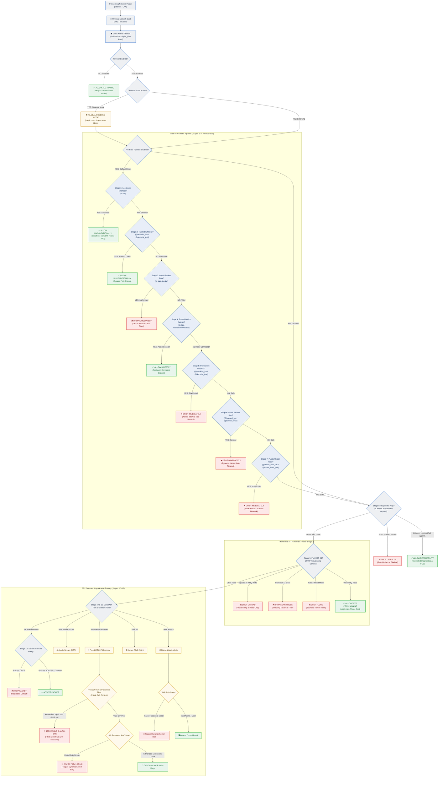
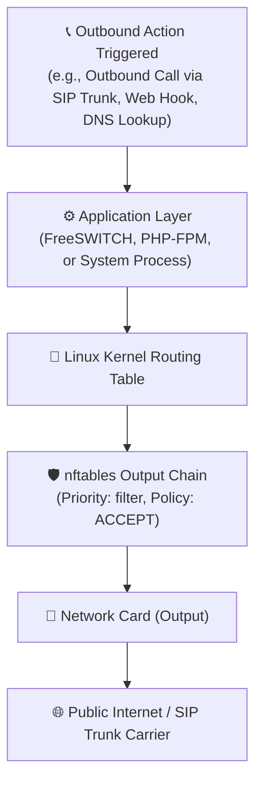
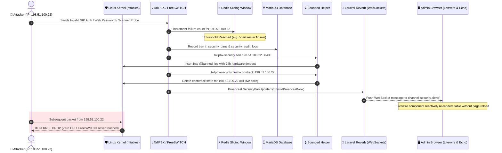

# TallPBX Security Architecture & Packet Flow Guide

This document provides a comprehensive, easy-to-understand overview of how TallPBX defends your business phone system and server. It explains how incoming network traffic travels through the security layers, how attacks are detected and neutralized in real time, and how settings survive server reboots.

---

## 1. Visual Packet Flow: Inbound Traffic

When an internet packet reaches the server's network interface, it is evaluated by the Linux kernel **before** any application software (like FreeSWITCH or the web server) ever sees it.

TallPBX compiles an optimized, multi-stage Linux kernel firewall ruleset using native `nftables` (`table inet tallpbx_filter`, hook `input`, priority `-10`).

The diagram below illustrates this path from input to processing:


```mermaid
flowchart TD
    %% Styling Classes
    classDef drop fill:#fde8e8,stroke:#e05252,stroke-width:2px,color:#7a1010
    classDef allow fill:#e8f5ec,stroke:#3fb950,stroke-width:2px,color:#1a6b32
    classDef spine fill:#eef0f3,stroke:#5b8fd9,stroke-width:2px,color:#1c2a40
    classDef svc fill:#fef9ec,stroke:#d29922,stroke-width:2px,color:#5a3e08
    classDef prefilter fill:#e8eef8,stroke:#4a77b4,stroke-width:2px,color:#15325b

    %% Root Ingress Trunk (Centered)
    A["🌐 Incoming Network Packet<br/>(Internet / LAN)"]:::spine --> B["🔌 Physical Network Card<br/>(eth0 / ens3 / lo)"]:::spine
    B --> C["🛡️ Linux Kernel Firewall<br/>(nftables inet tallpbx_filter input)"]:::spine

    %% Global Mode Checks
    C --> FW_CHECK{"Firewall Enabled?"}:::spine
    FW_CHECK -->|NO: Disabled| PASS_ALL["✅ ALLOW ALL TRAFFIC<br/>(Only lo & established active)"]:::allow
    FW_CHECK -->|YES: Enabled| OBS_CHECK{"Observe Mode Active?"}:::spine

    OBS_CHECK -->|YES: Observe Mode| OBS_NOTE["👁️ GLOBAL OBSERVE MODE<br/>(Log & count drops, never block)"]:::svc
    OBS_CHECK -->|NO: Enforcing| PREFILTER_CHECK{"Pre-Filter Pipeline Enabled?"}:::spine
    OBS_NOTE --> PREFILTER_CHECK

    %% Subgraph: Reorderable Pre-Filter Pipeline (Stages 1-7)
    subgraph PREFILTER ["Built-in Pre-Filter Pipeline (Stages 1–7: Reorderable)"]
        direction TB
        PREFILTER_CHECK -->|YES: Default Order| D{"Stage 1: Loopback Interface?<br/>(iif 'lo')"}:::prefilter
        D -->|YES: Localhost| PASS_LO["✅ ALLOW UNCONDITIONALLY<br/>(Localhost MariaDB, Redis, IPC)"]:::allow
        D -->|NO: External| S2{"Stage 2: Trusted Whitelist?<br/>(@whitelist_ips / @whitelist_ips6)"}:::prefilter

        S2 -->|YES: Admin / Office| PASS_WL["✅ ALLOW UNCONDITIONALLY<br/>(Bypass Port Checks)"]:::allow
        S2 -->|NO: Untrusted| S3{"Stage 3: Invalid Packet State?<br/>(ct state invalid)"}:::prefilter

        S3 -->|YES: Malformed| DROP_INV["❌ DROP IMMEDIATELY<br/>(Out-of-Window / Bad Flags)"]:::drop
        S3 -->|NO: Valid| S4{"Stage 4: Established or Related?<br/>(ct state established,related)"}:::prefilter

        S4 -->|YES: Active Session| PASS_FAST["✅ ALLOW DIRECTLY<br/>(Fast-path Conntrack Bypass)"]:::allow
        S4 -->|NO: New Connection| S5{"Stage 5: Permanent Blacklist?<br/>(@blacklist_ips / @blacklist_ips6)"}:::prefilter

        S5 -->|YES: Blacklisted| DROP_BL["❌ DROP IMMEDIATELY<br/>(Kernel Interval Tree Discard)"]:::drop
        S5 -->|NO: Safe| S6{"Stage 6: Active Intruder Ban?<br/>(@banned_ips / @banned_ips6)"}:::prefilter

        S6 -->|YES: Banned| DROP_BAN["❌ DROP IMMEDIATELY<br/>(Dynamic Kernel Auto-Timeout)"]:::drop
        S6 -->|NO: Safe| S7{"Stage 7: Public Threat Feed?<br/>(@threat_feed_ips / @threat_feed_ips6)"}:::prefilter

        S7 -->|YES: VoIPBL Hit| DROP_FEED["❌ DROP IMMEDIATELY<br/>(Public Fraud / Scanner Network)"]:::drop
    end

    PREFILTER_CHECK -->|NO: Disabled| S8
    S7 -->|NO: Safe| S8{"Stage 8: Diagnostic Ping?<br/>(ICMP / ICMPv6 echo-request)"}:::spine

    %% Stages 8-12: Core Services & Policies
    S8 -->|Echo > Limit / Stealth| DROP_ICMP["❌ DROP / STEALTH<br/>(Rate Limited or Blocked)"]:::drop
    S8 -->|Echo <= Limit or IPv6 ND/RA| PASS_ICMP["✅ ALLOW REACHABILITY<br/>(Controlled Diagnostics & IPv6)"]:::allow
    S8 -->|Non-ICMP Traffic| S9{"Stage 9: Port UDP 69?<br/>(TFTP Provisioning Defense)"}:::spine

    subgraph TFTP_PROFILE ["Hardened TFTP Defense Profile (Stage 9)"]
        direction TB
        S9 -->|Opcode 2: WRQ Write| DROP_TFTP_WRQ["❌ DROP UPLOAD<br/>(Provisioning is Read-Only)"]:::drop
        S9 -->|Traversal '../' or '/x'| DROP_TFTP_PROBE["❌ DROP SCAN PROBE<br/>(Directory Traversal Filter)"]:::drop
        S9 -->|Rate > Flood Meter| DROP_TFTP_FLOOD["❌ DROP FLOOD<br/>(Bounded Kernel Meter)"]:::drop
        S9 -->|Valid RRQ Read| PASS_TFTP["✅ ALLOW TFTP PROVISIONING<br/>(Legitimate Phone Boot)"]:::allow
    end

    S9 -->|Other Ports| S10{"Stage 10 & 11: Core PBX Port or Custom Rule?"}:::spine

    %% Subgraph: Application & Services
    subgraph SERVICES ["PBX Services & Application Routing (Stages 10–12)"]
        direction TB
        S10 -->|SIP 5060/5061/5080| K["📞 FreeSWITCH Telephony"]:::svc
        S10 -->|RTP 16384-32768| L["🔊 Audio Stream (RTP)"]:::svc
        S10 -->|Web 80/443| M["🌐 Nginx & Web Admin"]:::svc
        S10 -->|SSH 22| N["🔒 Secure Shell (SSH)"]:::svc
        S10 -->|No Rule Matched| S12{"Stage 12: Default Inbound Policy?"}:::spine

        S12 -->|Policy = DROP| DROP_DEF["❌ DROP PACKET<br/>(Blocked by Default)"]:::drop
        S12 -->|Policy = ACCEPT / Observe| PASS_DEF["✅ ACCEPT PACKET"]:::allow

        %% Telephony Application Layer
        K --> BOT_CHECK{"FreeSWITCH SIP Scanner Filter<br/>(Public Call Context)"}:::svc
        BOT_CHECK -->|Known Bot: sipvicious, sipcli, etc.| DROP_BOT["🚨 403 HANGUP & AUTO-BAN<br/>(Flush Conntrack Live Sessions)"]:::drop
        BOT_CHECK -->|Valid SIP Peer| SIP_AUTH{"SIP Password & ACL Auth"}:::svc
        SIP_AUTH -->|Failed Auth Streak| DROP_AUTH["🚨 401/403 Failure Streak<br/>(Trigger Dynamic Kernel Ban)"]:::drop
        SIP_AUTH -->|Authorized Extension / Trunk| CALL_OK["📱 Call Connected & Audio Rings"]:::allow

        %% Web Application Layer
        M --> WEB_AUTH{"Web Auth Guard"}:::svc
        WEB_AUTH -->|Failed Password Streak| DROP_WEB["🚨 Trigger Dynamic Kernel Ban"]:::drop
        WEB_AUTH -->|Valid Admin / User| WEB_OK["🖥️ Access Control Panel"]:::allow
    end
```

---

## 2. Inbound Pipeline Stages Detailed

The Linux kernel evaluates rules strictly in order across **12 deterministic stages**:

### 1. Pre-Filter Pipeline (Stages 1–7)
Toggled and reordered as an administrative unit in the **Firewall Rules** tab:
1. **Loopback Interface (`iif "lo" accept`)**: Unconditional access for server processes (PHP-FPM to MariaDB, Redis, and FreeSWITCH ESL).
2. **Trusted Whitelist (`@whitelist_ips accept`)**: Admin IPs, office subnets, and SIP carrier interconnects bypass all lower drop checks.
3. **Invalid Packet State (`ct state invalid drop`)**: Corrupted headers and illegal TCP flag combinations are discarded immediately.
4. **Stateful Fast Path (`ct state established,related accept`)**: Established call audio (RTP) and active sessions pass with zero CPU lookup overhead.
5. **Permanent Blacklist (`@blacklist_ips drop`)**: Explicitly forbidden IPs/CIDRs dropped at line rate via kernel interval trees.
6. **Active Intrusion Bans (`@banned_ips drop`)**: Dynamic hardware-timed bans triggered by authentication failures or scanner probes.
7. **Public Threat Feeds (`@threat_feed_ips drop`)**: Curated VoIP fraud and scanner networks (e.g. VoIPBL) dropped at the perimeter.

### 2. Diagnostics & Protocol Defense (Stages 8–9)
8. **ICMP Ping Diagnostics**: Rate-limited ping requests (5/sec) plus essential IPv6 neighbor discovery (`nd-neighbor-solicit`, `nd-router-advert`).
9. **Hardened TFTP Defense Profile (UDP 69)**: Protects phone provisioning by dropping upload requests (WRQ opcode 2), directory traversal probes (`../`, `/x`), and flood requests.

### 3. Service Catalog & Fallback (Stages 10–12)
10. **Core PBX Port Catalog**: Explicit allow rules for SIP (5060/5061/5080), RTP Audio (16384–32768), Web Admin (80/443), and SSH (22).
11. **Custom Sequential Rules**: User-defined rules evaluated in assigned priority order (first match wins).
12. **Default Inbound Policy**: Final fallback verdict (`Drop` or `Accept`; forced to `Accept` in Global Observe Mode).

### 4. Application Layer Defense (FreeSWITCH Dialplan)
When packets reach FreeSWITCH on port 5060/5080:
- **SIP Bot Signatures**: Public dialplan contexts evaluate incoming requests against known scanner tools (`sipvicious`, `friendly-scanner`, `sipcli`, `VaxSIPUserAgent`), immediately rejecting them with `403 Forbidden`.
- **Auto-Banning & Conntrack Flushing**: Detected scanners trigger an instant kernel ban and terminate active TCP/UDP flows via conntrack flushing.

---

## 3. Visual Packet Flow: Outbound Traffic

Outbound traffic generated by the server (such as FreeSWITCH connecting to a SIP provider trunk, outbound phone calls, or administrative web notifications) follows a streamlined outbound chain:


```mermaid
flowchart TD
    A["📞 Outbound Action Triggered<br/>(e.g., Outbound Call via SIP Trunk, Web Hook, DNS Lookup)"] --> B["⚙️ Application Layer<br/>(FreeSWITCH, PHP-FPM, or System Process)"]
    B --> C["🔀 Linux Kernel Routing Table"]
    C --> D["🛡️ nftables Output Chain<br/>(Priority: filter, Policy: ACCEPT)"]
    D --> E["🔌 Network Card (Output)"]
    E --> F["🌐 Public Internet / SIP Trunk Carrier"]
```

*Note: By default, the output chain policy is set to `ACCEPT`. The stateful connection tracker (`ct state established,related accept`) automatically correlates response packets from the outside world back to the originating outbound connection.*

---

## 4. Real-Time Attack Neutralization & WebSocket Alert Flow

TallPBX does **not** rely on slow log-scraping utilities like Fail2ban. Intrusion prevention occurs in-process with real-time sliding windows in Redis, immediate Linux kernel banning, conntrack session severing, and instant WebSocket broadcasting over **Laravel Reverb**:

> **How the Detection Window Works:**
> Whenever an IP has a failed login or SIP registration attempt, TallPBX starts a temporary counter in memory. If that IP reaches the **Max Allowed Failed Attempts** within the **Detection Window** (10 minutes by default), it is automatically banned. If no more failures occur before the window expires, the counter resets back to zero. This ensures that occasional typos or forgotten passwords over long periods won't accumulate into an accidental ban.


```mermaid
sequenceDiagram
    autonumber
    actor Attacker as 🦹 Attacker (IP: 198.51.100.22)
    participant Kernel as 🛡️ Linux Kernel (nftables)
    participant App as 📞 TallPBX / FreeSWITCH
    participant Redis as ⚡ Redis Sliding Window
    participant DB as 🗄️ MariaDB Database
    participant Helper as 🔒 Bounded Helper
    participant Reverb as 📡 Laravel Reverb (WebSockets)
    participant UI as 🖥️ Admin Browser (Livewire & Echo)

    Attacker->>App: Sends Invalid SIP Auth / Web Password / Scanner Probe
    App->>Redis: Increment failure count for 198.51.100.22
    Note over Redis: Threshold Reached (e.g. 5 failures in 10 min)
    App->>DB: Record ban in security_bans & security_audit_logs
    App->>Helper: tallpbx-security ban 198.51.100.22 86400
    Helper->>Kernel: Insert into @banned_ips with 24h hardware timeout
    App->>Helper: tallpbx-security flush-conntrack 198.51.100.22
    Helper->>Kernel: Delete conntrack state for 198.51.100.22 (Kill live calls)
    App->>Reverb: Broadcast SecurityBanUpdated (ShouldBroadcastNow)
    Reverb-->>UI: Push WebSocket message to channel 'security.alerts'
    Note over UI: Livewire component reactively re-renders table without page reload
    
    rect rgb(255, 230, 230)
    Attacker->>Kernel: Subsequent packet from 198.51.100.22
    Kernel-->>Attacker: ❌ KERNEL DROP (Zero CPU, FreeSWITCH never touched)
    end
```

### 4.1 Redis Decoupling & Graceful Degradation

- **Direct Redis Communication**: TallPBX's intrusion detection engine (`SecurityIncidentService`) talks directly to Redis via `Illuminate\Support\Facades\Redis` facade (`Redis::incr()`, `expire()`), bypassing Laravel's general `CACHE_STORE`. Configuring `CACHE_STORE=file` or `database` in `.env` does not alter or disable intrusion tracking.
- **Zero Database Load**: In-flight failure counters live strictly in Redis memory, preventing MariaDB lock contention during brute-force floods.
- **Fail-Open Resilience**: If Redis is stopped or unreachable, PBX and telephony operations continue uninterrupted (no 500 errors). Kernel firewall rules, whitelists, and manual bans remain 100% active. Sliding-window counters and automated bans automatically resume when Redis is restored.

---

## 5. Security Command Center Interface

The **Security Command Center** (`/panel/security`) provides an evaluation-ordered, four-tab interface mirroring the kernel packet filtering pipeline:


### Master Operational Switches (Top Banner)
Pinned directly above the tab strip for immediate visibility:
1. **Firewall Master Switch**: Toggles the entire host firewall on or off. When disabled, the kernel allows all traffic while maintaining loopback and established connection rules.
2. **Pre-Filter Pipeline Switch**: Enables or disables stages 1–7 as a single unit. Guarded by `LockoutGuardService::assertLocalServicesSafe()`—refuses to disable pre-filters if the default policy would drop loopback database/cache traffic.
3. **Global Observe Mode Switch**: Puts the entire firewall into non-blocking observation mode. Every rule still evaluates, counts packets, and logs would-be drops, but nothing is blocked. A prominent amber banner displays across all Security pages while active.

---

### The Four Evaluation-Ordered Tabs

#### Tab 1: Block & Allow Lists (`?tab=lists`)
* **Permanent Blacklist**: Forbidden IP addresses and CIDR subnets dropped at line rate via kernel interval trees (`@blacklist_ips` / `@blacklist_ips6`). Features CIDR mask validation and instant search.
* **Trusted Whitelist**: IP addresses and subnets exempt from all packet filtering (`@whitelist_ips` / `@whitelist_ips6`). Includes a 1-click self-protection button to automatically whitelist the current administrator's connection IP.

#### Tab 2: Attackers (`?tab=attackers`)
* **Active Intrusion Bans Table**: Real-time display of currently banned IPs, remaining hardware countdown timers, entry points / attack types (`SIP`, `Web`, `SSH`, `SIP Scanner`), and 1-click unban buttons.
* **SIP Bot & Scanner Signatures Card**:
  - **Instant Kernel Ban Toggle**: When turned on, detected SIP scanners are banned in the kernel immediately. (Ships off by default: scanners are blocked with 403 hangup and recorded without an IP ban).
  - **Ban Duration Selector**: 1 hour, 24 hours, 7 days, or permanent.
  - **Curated Signature Registry**: Base list of known automated tools (`sipvicious`, `friendly-scanner`, `VaxSIPUserAgent`, `sipcli`, `Ozeki`).
  - **Custom Signatures**: Add custom user-agent string matches.
* **Incident History & Audit Trail**: Real-time log of security events and threshold triggers.

#### Tab 3: Threat Feeds (`?tab=feeds`)
* **Public Threat Feeds (VoIPBL)**: Automated ingestion of public blocklists identifying active VoIP fraud and brute-force scanning networks.
* **Fail-Open Contract**: Feed downloads are memory-bounded and stream-parsed. If a download fails or is malformed, existing kernel entries remain untouched so the server is never left unprotected.
* **Country Filter**: Filter feed blocks to specific geographic regions or exclude your domestic operating countries.
* **Drop Counters & Emergency Escape**: Live per-feed kernel drop counters, on-demand "Sync Now" action, and a prominent "Remove all feed blocks" button in case of upstream false positives.

#### Tab 4: Firewall Rules (`?tab=rules`)
* **Pre-Filter Evaluation Order**: Interactive table showing the exact sequence of stages 1–7 with Up/Down reordering chevrons and a "Reset to recommended order" action.
* **Standard Services Port Catalog**: Telephony and system ports evaluated top-to-bottom:
  - **ICMP Ping Diagnostics**: Configurable source restriction, rate limiting, and stealth mode toggle.
  - **TFTP Provisioning Defense**: Hardened UDP 69 profile with shield badge showing real-time counters for blocked WRQ uploads, traversal attempts, and flood drops.
  - Core telephony services: SIP Signaling, RTP Audio Media, Web Admin, SSH, FreeSWITCH ESL, Reverb WebSockets, WebRTC.
* **Custom Sequential Rules**: Custom port and network rules with priority reordering (Up/Down buttons).
* **Default Inbound Policy**: Final fallback decision (`Drop` or `Accept`).

---

## 6. Understanding Sequential Firewall Rules: "Top to Bottom"

Firewall rules in the **Security Command Center** are evaluated sequentially from top to bottom.

### How It Works: First Match Wins
1. When traffic arrives, the firewall tests Rule #1 at the top.
2. If Rule #1 matches the packet, the action (**Allow** or **Block**) is taken **immediately**, and the firewall **stops checking any lower rules**.
3. If Rule #1 does not match, the firewall moves down to Rule #2, Rule #3, and so on.
4. If no rule matches, the firewall falls back to the **Default Inbound Policy** (Drop or Accept).

### Real-World Example
Suppose you want to block all incoming web traffic from the world, but allow your branch office (`203.0.113.50`) to access the web panel:

* **Correct Order (Specific before General)**:
  - **Rule 1 (Top)**: Allow Source `203.0.113.50` on Port `443`
  - **Rule 2 (Bottom)**: Block Source `Anywhere` on Port `443`
  *Result*: Your branch office matches Rule 1 and connects successfully. Everyone else moves to Rule 2 and is blocked.

* **Incorrect Order**:
  - **Rule 1 (Top)**: Block Source `Anywhere` on Port `443`
  - **Rule 2 (Bottom)**: Allow Source `203.0.113.50` on Port `443`
  *Result*: Your branch office is blocked! Because Rule 1 matched "Anywhere" first, evaluation stopped before Rule 2 was ever reached.

You can use the **Up** and **Down** priority buttons in the Security Center to arrange rules so specific exceptions always sit above broader policies.

---

## 7. Multi-Layer PBX Security: What Protects What?

TallPBX features distinct layers of security designed for different parts of the system:

| Security Component | Layer | Technology | Primary Purpose | Example |
| :--- | :--- | :--- | :--- | :--- |
| **Host Firewall** | Network / Kernel (OS) | Linux `nftables` | Blocks unwanted network packets before they reach any service. Protects the entire operating system. | Dropping brute-force bots, restricting SSH to management IPs, blocking unauthorized SIP traffic. |
| **Threat Feeds** | Network / Kernel (OS) | VoIPBL + `nftables` | Proactively drops known fraud and scanner IP networks at the kernel boundary. | Dropping traffic from distributed VoIP attack botnets before packets hit FreeSWITCH. |
| **TFTP Defense** | Network / Kernel (OS) | Linux `nftables` deep packet match | Drops write uploads (WRQ), traversal (`../`), and scan probes (`/x`) on UDP 69 before port accept. | Preventing attackers from uploading malicious configs or scanning phone provisioning files. |
| **Attack Protection** | In-Process Intrusion Defense | Redis + Reverb + `nftables` | Tracks authentication failures across SIP, Web login, and SSH, automatically banning offenders in kernel RAM. | Automatically blocking an IP for 24 hours after 5 failed phone registrations or admin passwords. |
| **SIP Scanner Filter** | Telephony (FreeSWITCH) | Dialplan signature matching | Curated pattern matching in public context; hangs up with 403 and severs live conntrack sessions. | Detecting `friendly-scanner` or `sipvicious` probes and terminating existing active calls. |
| **Access Control Lists (ACL)** | Telephony Engine (FreeSWITCH) | FreeSWITCH `mod_sofia` ACLs | Authorizes which trusted IP subnets or devices are allowed to register SIP extensions or connect carriers inside the phone engine. | Allowing SIP carriers (e.g. Twilio, Telnyx) to deliver calls without SIP password challenges. |
| **Event Rate Limits (Telephony)** | Application (TallPBX ESL Listener) | TallPBX `event-rate-limits` module | Caps how many FreeSWITCH events a single source can send per minute and per burst, protecting the PBX from event storms. | Blocking a misconfigured device that floods the system with repeated registration or DTMF events. |

---

## 8. Two-Tier Persistence & Server Reboot Retention

TallPBX uses a **two-tier architecture** to ensure security rules, IP lists, threat feeds, and active attacker bans survive reboots:

1. **Tier 1: MariaDB (Authoritative Source of Truth)**
   - Database tables (`security_bans`, `security_ip_lists`, `security_rules`, `security_settings`, `security_threat_feeds`) permanently store all whitelisted IPs, blacklisted subnets, custom firewall rules, PBX port definitions, and active attacker bans.

2. **Tier 2: Boot Persistence (`/etc/tallpbx/firewall.nft`, `/etc/tallpbx/threat_feed.nft`, & `/etc/nftables.conf`)**
   - Whenever any security change is made in the web UI, [SecurityConfigGenerator](../app-modules/security/src/Services/SecurityConfigGenerator.php) compiles the active ruleset directly into `/etc/tallpbx/firewall.nft`.
   - Threat feed elements are maintained in `/etc/tallpbx/threat_feed.nft` and loaded into `@threat_feed_ips`.
   - The systemd boot loader `/etc/nftables.conf` includes `/etc/tallpbx/firewall.nft`.
   - When the Linux server reboots, systemd's `nftables.service` executes `/etc/nftables.conf` before networking starts, instantly restoring all rules, trusted IPs, threat feeds, and temporary attacker bans with their remaining expiration times intact.

### Privilege Separation: Installer Secrets vs. Runtime Assets

TallPBX enforces a strict privilege separation boundary between root installer state and web-managed assets:

- **`/etc/default/tallpbx` (`0600 root:root`)**: Stored in Debian's standard `/etc/default/` location. Contains root installer credentials and tokens that the unprivileged web application (`www-data`) cannot read, modify, or delete.
- **`/etc/tallpbx/` (`2775 root:www-data`)**: Holds the active firewall rules (`firewall.nft`, `threat_feed.nft`) and certificates. The web panel stages `.pending` changes here, which the root helper validates and promotes.

> [!NOTE]
> **Atomic Swaps & Safety Checks**:
> All ruleset updates are atomic (all-or-nothing). TallPBX tests proposed rules with `nft -c` and runs zero-lockout guards before applying. If any check fails, the transaction is aborted and the existing active firewall continues uninterrupted. You are never left with broken or half-applied rules.

### Zero-Lockout Protections
Before any restrictive policy or rule change is applied, [LockoutGuardService](../app-modules/security/src/Services/LockoutGuardService.php) enforces two distinct safety checks:
1. **Administrator Connection Guard (`assertSafe()`)**: Checks the current administrator's active connection IP against the proposed ruleset. If a change would disconnect the active administrator, the change is rejected immediately with a descriptive warning.
2. **Local Services Guard (`assertLocalServicesSafe()`)**: Strictly forbids disabling pre-filters while the default policy is set to Block Unknown without an explicit loopback allow rule, guaranteeing that server processes (PHP-FPM, MariaDB, Redis) can never be severed from one another.

---

## 9. Linux CLI Administration & nftables Manual Management

System administrators can view, inspect, and update firewall rules, threat feeds, and intruder bans directly from the Linux command-line interface (CLI).

TallPBX provides three complementary levels of CLI control:
1. **TallPBX Artisan CLI** (*Recommended*): Keeps the database, Redis sliding windows, and kernel firewall synchronized.
2. **TallPBX Bounded Root Helper** (`/usr/local/sbin/tallpbx-security`): Directly interacts with the kernel firewall through a hardened, regex-validated binary.
3. **Direct Linux Kernel `nftables` Commands**: Standard OS utilities for low-level diagnostics and emergency recovery.

---

### 9.1 Method 1: TallPBX Artisan CLI (Recommended)

Running Artisan commands from the project root (`/var/www/tallpbx`) ensures that changes update the MariaDB authoritative database, Redis sliding windows, and the Linux kernel simultaneously.

#### View Engine Status & Active Bans
```bash
php artisan security:status
```
*Displays the firewall engine state, default policy (DROP/ACCEPT), observe mode state, whitelist/blacklist counts, threat feed sync status, active custom rule counts, and a formatted table of all currently banned IP addresses with their expiration timers.*

#### Lift an Attacker Ban
```bash
php artisan security:unban 198.51.100.22
```
*Removes the IP from the MariaDB `security_bans` table, clears the failure count in Redis, removes the IP from the kernel `@banned_ips`/`@banned_ips6` set, flushes conntrack sessions, and broadcasts a real-time event to all open browser sessions.*

#### Sync Public Threat Feeds
```bash
# Sync all active threat feeds
php artisan security:sync-threat-feeds

# Force sync ignoring HTTP cache
php artisan security:sync-threat-feeds --force
```
*Downloads the latest IP blocklists from configured threat feed providers (VoIPBL), filters by country, writes `/etc/tallpbx/threat_feed.nft.pending`, validates syntax with `nft -c`, and atomically promotes elements into kernel sets.*

#### Recompile & Apply Active Ruleset
```bash
php artisan security:apply
```
*Compiles the ruleset from MariaDB into `/etc/tallpbx/firewall.nft`, validates syntax with `nft -c`, tests zero-lockout safety against your connection IP and local loopback services, and safely applies the new ruleset to the kernel in a single all-or-nothing operation.*

*(To bypass lockout protection when working on a local serial console, pass the `--force` flag: `php artisan security:apply --force`)*

---

### 9.2 Method 2: Bounded Root Helper (`/usr/local/sbin/tallpbx-security`)

TallPBX installs a dedicated, root-owned helper script (`/usr/local/sbin/tallpbx-security`, mode `0750 root:www-data`, so the web user can execute but never modify the script) with a matching sudoers entry (`/etc/sudoers.d/tallpbx-security`). This script enforces strict parameter regex validation before executing kernel operations:

#### View Active Kernel Table Status
```bash
sudo /usr/local/sbin/tallpbx-security status
```
*Lists firewall chains and rules without dumping millions of threat-feed set elements, preventing multi-second console hangs.*

#### Ban an Attacker Immediately
```bash
# Ban an IP for 1 hour (3600 seconds)
sudo /usr/local/sbin/tallpbx-security ban 198.51.100.22 3600

# Ban an IP for 24 hours (86400 seconds)
sudo /usr/local/sbin/tallpbx-security ban 198.51.100.22 86400

# Ban an IP permanently (0 seconds)
sudo /usr/local/sbin/tallpbx-security ban 198.51.100.22 0
```

#### Unban an Attacker
```bash
sudo /usr/local/sbin/tallpbx-security unban 198.51.100.22
```

#### Flush Active Conntrack Sessions
```bash
sudo /usr/local/sbin/tallpbx-security flush-conntrack 198.51.100.22
```
*Deletes all active connection tracking flows for the given IP address, immediately terminating in-flight phone calls and active TCP sessions.*

#### Update Threat Feed Elements
```bash
sudo /usr/local/sbin/tallpbx-security update-threat-feed
```
*Validates `/etc/tallpbx/threat_feed.nft.pending` with `nft -c`, atomically moves it to `/etc/tallpbx/threat_feed.nft`, and loads elements into kernel sets.*

#### Helper Capability & Version Check
```bash
sudo /usr/local/sbin/tallpbx-security version
```

---

### 9.3 Method 3: Direct Linux `nftables` Commands

System administrators with root or sudo access can inspect and interact directly with Linux `nftables`:

#### Viewing Firewall State
| Diagnostic Action | Command |
| :--- | :--- |
| **View Complete Ruleset** | `sudo nft list ruleset` |
| **View TallPBX Table Only** | `sudo nft list table inet tallpbx_filter` |
| **View Active Banned IPs** | `sudo nft list set inet tallpbx_filter banned_ips` |
| **View Whitelist IPs/Subnets** | `sudo nft list set inet tallpbx_filter whitelist_ips` |
| **View Blacklist IPs/Subnets** | `sudo nft list set inet tallpbx_filter blacklist_ips` |
| **View Threat Feed IPs** | `sudo nft list set inet tallpbx_filter threat_feed_ips` |
| **View Inbound Chain & Packet Counters** | `sudo nft list chain inet tallpbx_filter input` |

#### Emergency Recovery: Panel and `php artisan` Unreachable

When a misapplied ruleset cuts the server's own network services, both the web panel and every `php artisan` command hang, because the application can no longer reach MariaDB (port 3306) or Redis (port 6379) over the loopback interface. SSH access usually still works — it is a direct port rule in the same ruleset. Recovery is done entirely in the shell: these commands are plain Linux `nftables` operations and need no PHP, no Laravel, and no database.

Work through the steps in order and stop as soon as the panel responds again:

1. **Restore the server's own connections first** (keeping every other rule). This is nearly always the whole fix, because the loopback interface is what a misapplied ruleset cuts first:
   ```bash
   sudo nft insert rule inet tallpbx_filter input iif "lo" accept
   ```
2. **Restore your administrator address** (for example your office or VPN address), keeping every other rule:
   ```bash
   sudo nft insert rule inet tallpbx_filter input ip saddr <your-ip> accept
   ```
3. **Switch the chain to allow-by-default without discarding its rules**, so they can be inspected and re-applied properly from the panel:
   ```bash
   sudo nft 'chain inet tallpbx_filter input { policy accept; }'
   ```
4. **Last resort** — removes every table and rule. The server accepts all inbound traffic until the firewall is applied again:
   ```bash
   sudo nft flush ruleset
   ```

If step 1 reports `No such file or directory`, the TallPBX table is not loaded in the kernel (for example after a reboot or a full flush) — list what is present with `sudo nft list tables` before continuing.

> [!WARNING]
> Do **not** simply reload `/etc/tallpbx/firewall.nft` if it is the file that caused the lockout — reloading it re-applies the same problem. Fix the configuration first, then apply.

After recovery, re-apply from the Security Center (or `php artisan security:apply`) so the saved configuration and the kernel agree again.

---

### 9.4 Persistence Reference: Web UI vs. CLI vs. Direct nftables

| Management Channel | Primary Use Case | Persistence Scope |
| :--- | :--- | :--- |
| **Web UI (Security Center)** | Day-to-day administration & real-time monitoring | **Permanent**: Saved to MariaDB & compiled to `/etc/tallpbx/firewall.nft` (survives reboots). |
| **TallPBX Artisan CLI** (`security:*`) | Scripted administration & system maintenance | **Permanent**: Synchronizes MariaDB, Redis, and kernel sets simultaneously. |
| **Bounded Root Helper** (`tallpbx-security`) | Fast, hardened CLI operations (ban, unban, flush) | **Dynamic**: Injected directly into kernel sets (expires per timeout or next reload). |
| **Direct `nftables` CLI** (`nft`) | Emergency shell recovery & low-level kernel inspection | **Volatile**: Live kernel RAM only; replaced on next application apply. |
