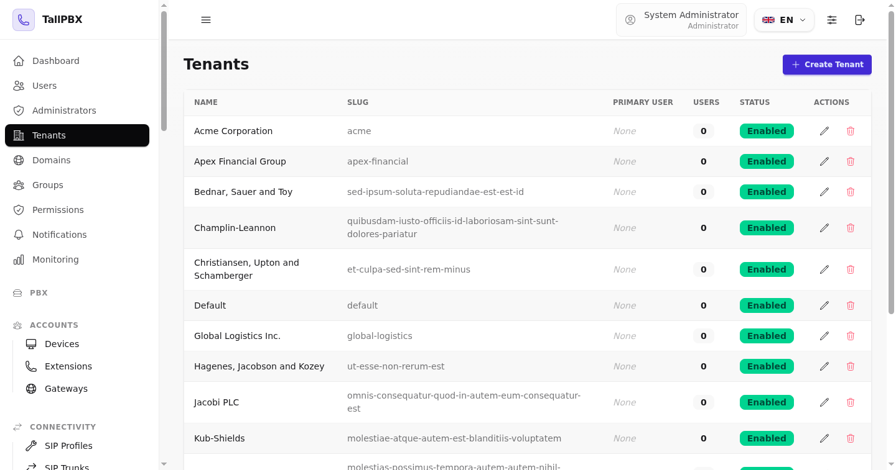
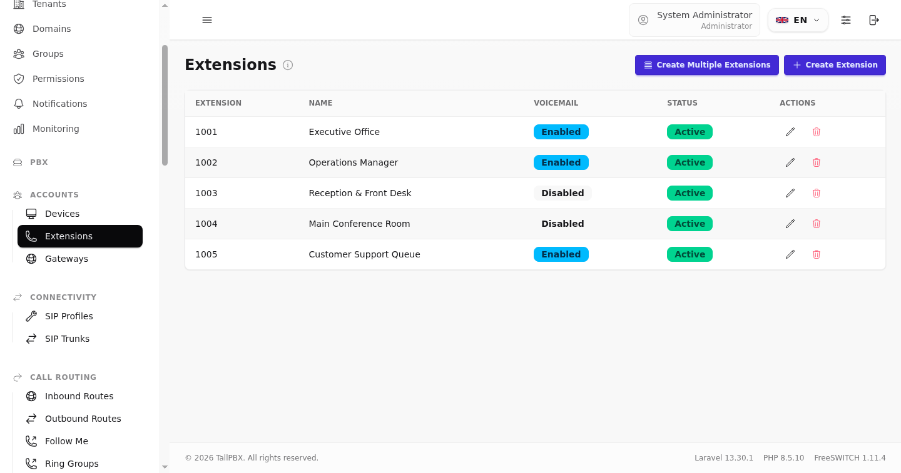
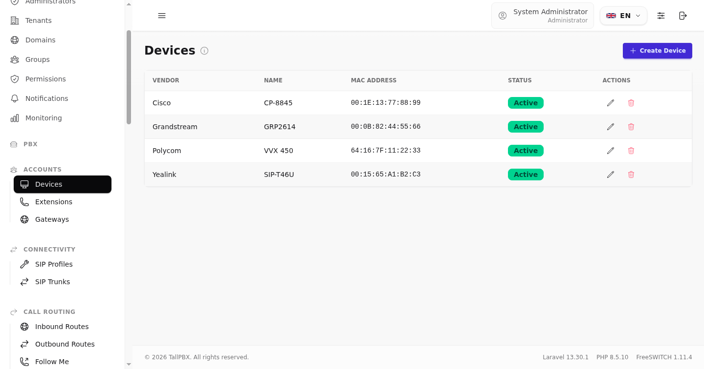

# TallPBX Visual Tour & User Interface Showcase

TallPBX features a modern, responsive user interface built on the **TALL stack** (**T**ailwind CSS v4, **A**lpine.js, **L**ivewire 4, and **L**aravel 13) with DaisyUI components. 

The interface provides instant light and dark color themes, three switchable navigation layouts with per-user database persistence, and clean data tables with real-time feedback for multi-tenant business telephony.

---

## 1. Public Guest Landing Page

The public landing page is localized for SEO (`/en`, `/es`, `/fr`) and provides quick access for both client tenant users and system administrators. It features an interactive SVG telephony network diagram and instant color-theme switching.

### Light Theme

### Dark Theme

---

## 2. Unified Control Panel & Layout Modes

TallPBX uses a single unified panel architecture (`/panel/`) for both system administrators and tenant users, with menu visibility governed by granular permissions. 

Users can customize their navigation layout via the display settings menu. Preferences are instantly dispatched to Alpine.js and saved to the database.

### Mode A: Full Sidebar Navigation (`w-64`)
The default desktop layout provides an expansive sidebar organized by functional PBX domains (Accounts, Connectivity, Call Routing, PBX Features, Media, Operations, and Administration) with preserved scroll position across navigation.

### Mode B: Mini Icon-Rail Sidebar (`w-16`)
For smaller screens or maximized workspace, the sidebar collapses into a compact icon rail. Icons remain fully accessible with instant tooltips, maximizing horizontal data table area.

### Mode C: Horizontal Topbar Navigation
For administrators accustomed to classic PBX topbars or horizontal workflow menus, the navigation transforms into responsive topbar dropdowns with breadcrumb pathing.

---

## 3. Core PBX Administration Views

### Multi-Tenant Management
Manage multiple organizations, customer tenants, and internal business units from a single interface. Each tenant maintains isolated SIP credentials, extensions, routes, and call data.

### Extension Management
Configure SIP extensions with custom caller ID, directory display names, voicemail integration, and call forwarding rules.

### Device Provisioning & Hardware Management
Assign SIP accounts to physical VoIP desk phones (Yealink, Polycom, Grandstream, Cisco) or softphones with auto-provisioning MAC address tracking and templates.

