# TallPBX Visual Tour & User Interface Showcase

TallPBX features a modern, responsive user interface built on the **TALL stack** (**T**ailwind CSS v4, **A**lpine.js, **L**ivewire 4, and **L**aravel 13) with DaisyUI components. 

The interface provides instant light and dark color themes, three switchable navigation layouts with per-user database persistence, and clean data tables with real-time feedback for multi-tenant business telephony.

---

## 1. Public Guest Landing Page

The public landing page is localized (`/en`, `/es`, `/fr`) and provides direct sign-in access to the unified management panel. It features an interactive SVG telephony network diagram and instant color-theme switching.

### Light Theme
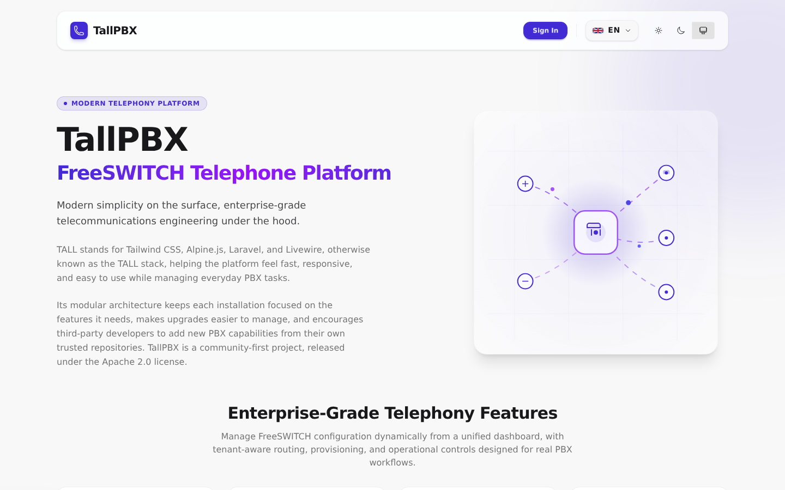

### Dark Theme
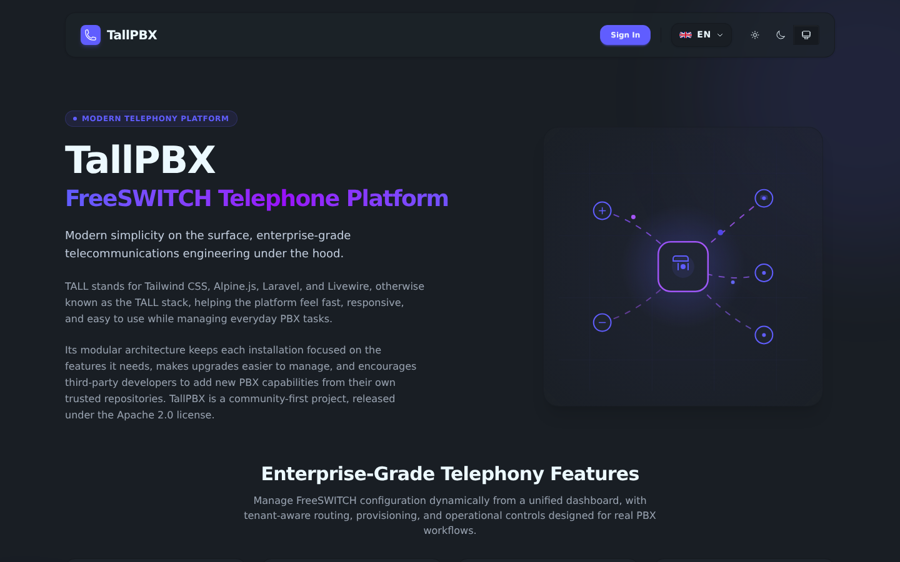

### Color Themes

TallPBX supports instantaneous switching between **Light**, **Dark**, and **System** themes:
- **Light Theme**: High-contrast, crisp layout designed for brightly lit offices.
- **Dark Theme**: Low-glare dark surfaces reducing eye strain during night shifts or in low-light environments.
- **System Theme**: Automatically mirrors your operating system preference (`prefers-color-scheme`).

Preferences are cached in your browser for instant loading and synchronized to your user profile in the database.

---

## 2. Unified Control Panel & Layout Modes

TallPBX uses a single unified panel architecture (`/panel/`) for both system administrators and tenant users, with menu visibility governed by granular permissions. 

Users can customize their navigation layout and color theme (Light, Dark, System) via the unified display settings menu in the header. Preferences are instantly dispatched to Alpine.js, rendered with zero flicker, and saved to the database.

### Mode A: Full Sidebar Navigation (`w-64`)
The default desktop layout provides an expansive sidebar organized by functional PBX domains (Accounts, Connectivity, Call Routing, PBX Features, Media, Operations, and Administration) with preserved scroll position across navigation.

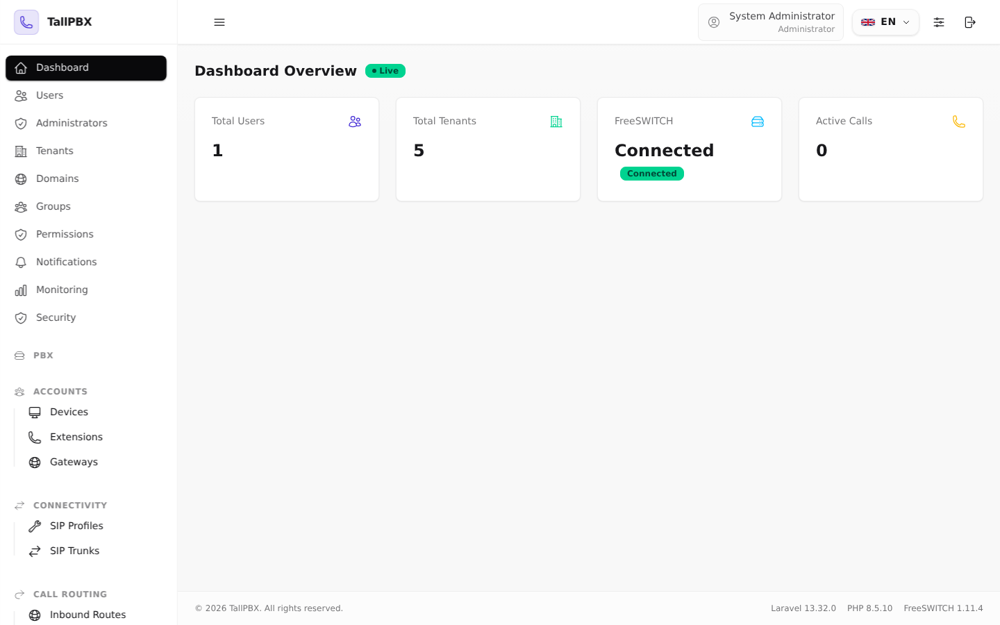

### Mode B: Mini Icon-Rail Sidebar (`w-16`)
For smaller screens or maximized workspace, the sidebar collapses into a compact icon rail. Icons remain fully accessible with instant tooltips, maximizing horizontal data table area.

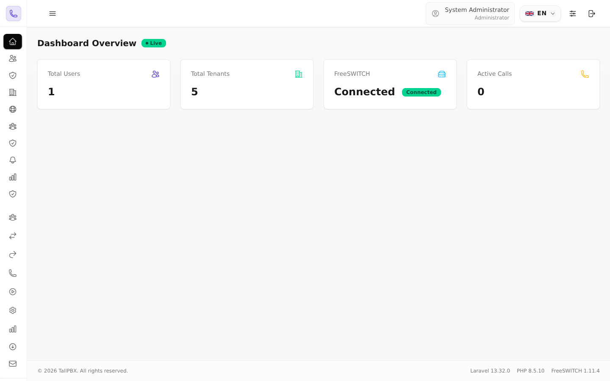

### Mode C: Horizontal Topbar Navigation
For administrators accustomed to classic PBX topbars or horizontal workflow menus, the navigation transforms into responsive topbar dropdowns with breadcrumb pathing.

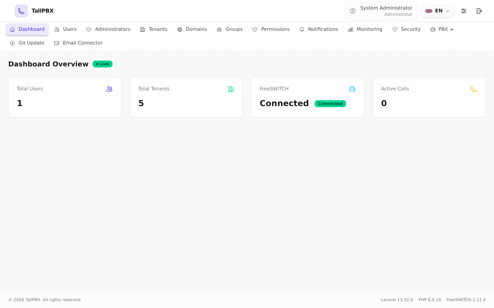

---

## 3. Core PBX Administration Views

### Multi-Tenant Management
Manage multiple organizations, customer tenants, and internal business units from a single interface. Each tenant maintains isolated SIP credentials, extensions, routes, and call data.

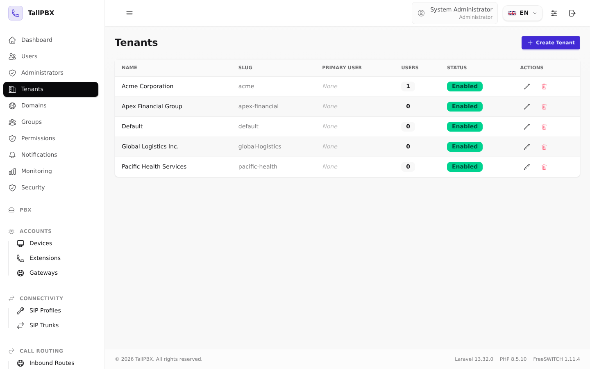

### Extension Management
Configure SIP extensions with custom caller ID, directory display names, voicemail integration, and call forwarding rules.

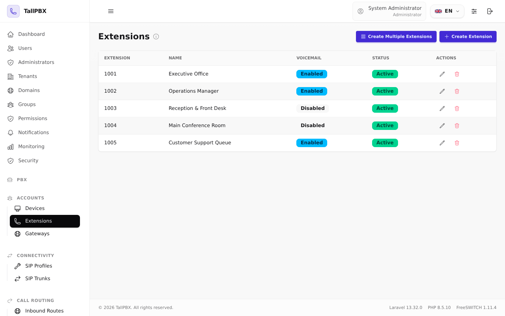

### Device Provisioning & Hardware Management
Assign SIP accounts to physical VoIP desk phones (Yealink, Polycom, Grandstream, Cisco) or softphones with auto-provisioning MAC address tracking and templates.

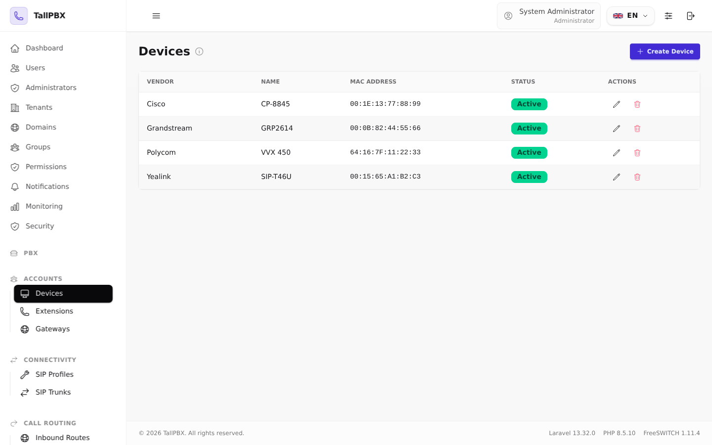

### User Impersonation & Tenant Support Troubleshooting
System administrators can troubleshoot tenant issues in real time by impersonating any tenant user with a single click from the Users directory.

The panel immediately reconfigures into the tenant user's perspective, applying their exact tenant scope and permissions. A prominent, persistent amber banner at the top of every page alerts the administrator that impersonation is active and provides an instant **"Stop Impersonating"** button to safely return to the admin session with zero session leakage.

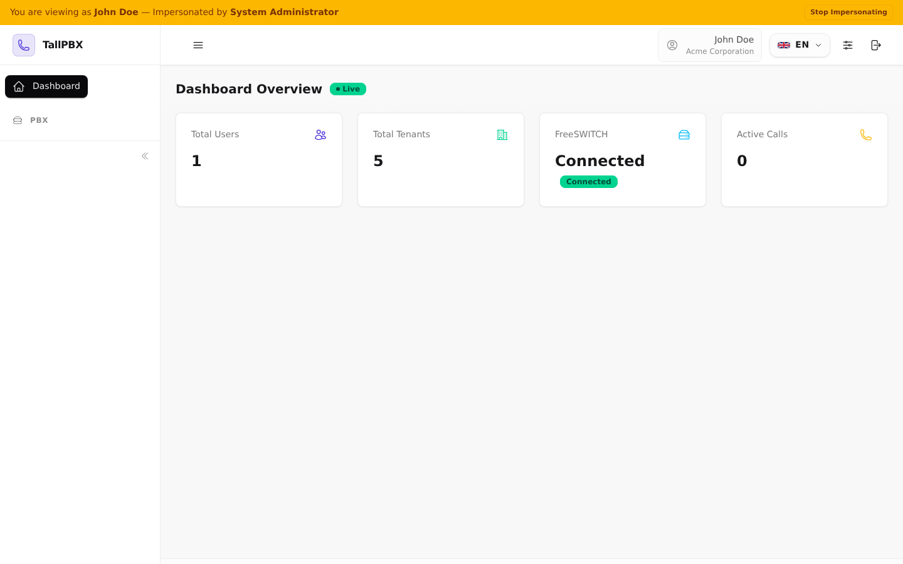

### Multi-Language Localization (English, Spanish, French)
TallPBX provides comprehensive multi-language support across the unified control panel and public interfaces.

Users can toggle their preferred language instantly via the topbar language dropdown menu. The selection is immediately applied to all interface text, labels, and tooltips, while being saved to the user's database record (`HasLocalePreference`) so all system notifications, emails, and voicemail alerts are dispatched in their chosen language.

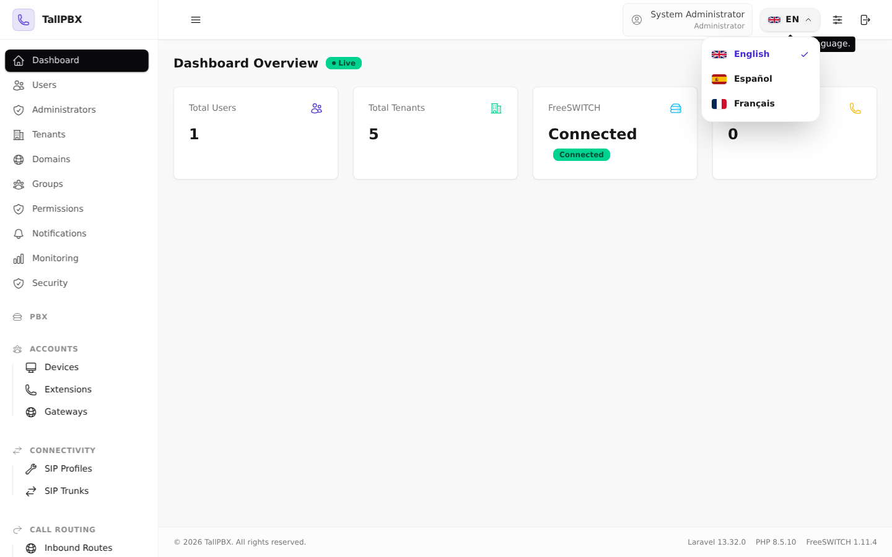

---

## 4. Security Center & Host Firewall

The **Security Center** (`/panel/security`) provides system administrators with real-time control and visibility over the Linux kernel `nftables` host firewall, automated intrusion detection, public threat intelligence feeds, and telephony bot defense.

* **Reactive Live Updates**: Connected directly to **Laravel Reverb WebSockets** via **Laravel Echo** — active threat counters, ban expirations, feed sync status, and rule changes update reactively without requiring page refreshes.
* **Master Operational Switches & Zero-Lockout**: Pinned controls for the Firewall Master Switch and Global Observe Mode (with live would-be drop badges, dedicated **Observed Traffic Activity** drawer, and `php artisan security:observe` CLI inspection), protected by automated preflight guards that ensure the administrator's connection and local database/cache services can never be severed.
* **Four Evaluation-Ordered Tabs**:
  - **Allow & Block Lists**: Trusted Whitelist with 1-click self-protection for administrator IPs, and permanent CIDR-aware Blacklist.
  - **Attackers**: Active intrusion bans with entry-point badges (`SIP`, `Web`, `SSH`, `SIP Scanner`), hardware countdown timers, and the **SIP Bot & Scanner Signatures** card (curated scanner tool detection, auto-ban toggle, and live conntrack session termination).
  - **Threat Feeds**: Automated public VoIP fraud intelligence (VoIPBL) with country filtering, live drop counters, and fail-open resilience.
  - **Firewall Rules**: Interactive, reorderable 7-stage pre-filter pipeline with a dedicated **Pre-Filters** toggle in the section header (pinned loopback rule with lock icon, greyed-out visual feedback when turned off, and Lockout Guard safety enforcement), PBX port catalog with hardened **TFTP Provisioning Defense** (UDP 69), custom sequential rules, and fallback default policy with in-progress animation.

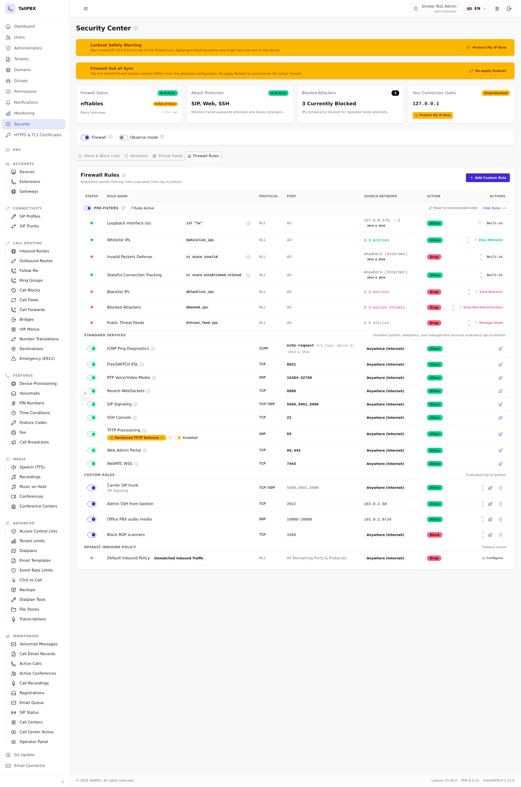

---

## 5. HTTPS & TLS Certificate Management

The **Certificate Manager** (`/panel/certificates`) provides a unified, web-native interface for securing both administrative web traffic (Nginx HTTPS and Reverb WebSockets) and VoIP telephony signaling (FreeSWITCH SIP TLS :5061 and WebRTC Secure WebSockets :7443) without touching the Linux command line.

* **Unified Certificate Inventory**: Track all active certificates, domain coverage (SANs), issuers, and real-time expiration badges across Web and Telephony services.
* **Automated Let's Encrypt (ACME v2)**: Issue and automatically renew certificates via standard HTTP-01 webroot challenges or DNS-01 challenges using Cloudflare API credentials stored securely in the encrypted DNS Vault (enabling wildcard `*.domain.com` certificates).
* **Custom PEM Import**: Upload or paste commercial certificates with live, client-side cryptographic modulus matching between certificates and private keys before submission.
* **Self-Signed Certificate Generator**: Instantly generate RSA/ECDSA certificates with SAN extensions for lab testing, development environments, and internal deployments.
* **Zero-Downtime Atomic Swaps**: Validates cryptographic modulus alignment and Nginx configuration syntax atomically before executing service reloads, preventing web server lockouts or FreeSWITCH crashes.

